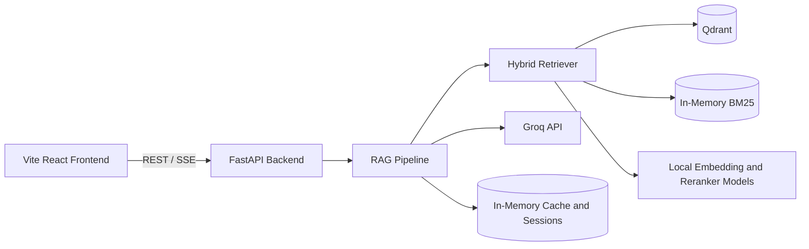
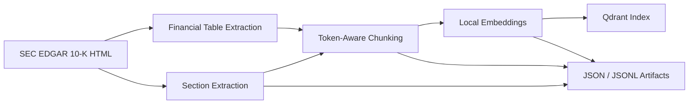
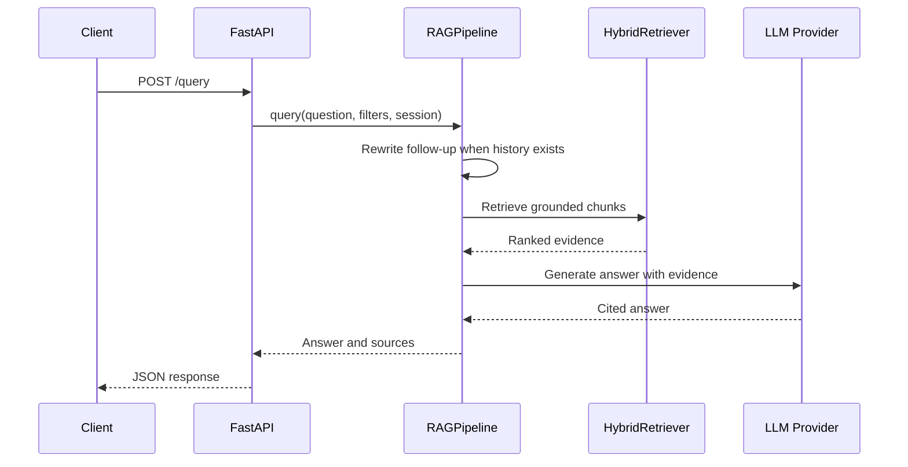
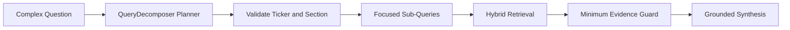

# Architecture

This document describes the stable system design of Enterprise Document QA. Use
`README.md` for setup and public status, `PROJECT_STATE.md` for current metrics
and engineering decisions, and `AGENTS.md` for repository operating rules.

## System Context



The frontend and backend are separate applications and deployment units. The
backend Docker image does not build or serve the frontend. Browser-exposed
configuration is limited to `VITE_*` values and must not contain secrets.

## Deployment Topology

The default portfolio deployment is one FastAPI process with one Uvicorn worker:

```text
Vercel-hosted frontend
  -> HTTPS FastAPI backend
     -> local embedding and cross-encoder models
     -> local Qdrant volume
     -> Groq generation API
```

One worker is mandatory when `QDRANT_MODE=local` because embedded Qdrant uses a
file lock. Multi-worker or multi-instance serving requires Qdrant Server or
Qdrant Cloud plus shared state for rate limits, cache, and sessions.

The backend supports two vector-store modes behind the same `VectorStore`
interface:

| Mode | Intended use | Constraint |
|---|---|---|
| Local Qdrant | Default single-container deployment | One process must own the storage path |
| Qdrant Cloud | Multi-instance or externally managed deployment | Adds network latency and an external dependency |

Docker uses CPU-only PyTorch for portability. Local development can install a
CUDA PyTorch build independently.

## Offline Data Pipeline



The pipeline is intentionally file-backed and explicit:

1. `scripts.download_filings` downloads filings and extracts target sections.
2. `scripts.chunk_filings` creates text chunks.
3. `scripts.add_table_chunks` appends supplemental financial-table chunks.
4. `scripts.embed_chunks` generates embeddings and reprocesses stale outputs.
5. `scripts.index_chunks` rebuilds the local Qdrant collection.

Generated filings, chunks, embeddings, Qdrant storage, and evaluation artifacts
remain under `data/` and are excluded from git.

The extractor targets standard 10-K Item boundaries. Annual-report layouts,
page-range references, and incorporation-by-reference filings require a separate
extraction branch rather than changes to retrieval.

## Online Query Paths

### Standard Query



`/query` runs synchronous pipeline work in an abandonable AnyIO worker. The HTTP
request returns `504` after the hard deadline. Python cannot safely terminate a
thread already executing, so a timed-out worker may finish in the background and
its result is discarded.

### Streaming Query

`/query/stream` uses Server-Sent Events with `sources`, `token`, `done`, and
`error` events. A shared `threading.Event` propagates cancellation from client
disconnect or timeout through the pipeline and provider token loops. Partial
answers are not stored in cache or conversation memory after cancellation.

### Decomposed Query



`/query/decomposed` handles comparative and enumeration-style questions. Planner
output is treated as untrusted: unsupported tickers and invalid sections are
dropped before execution. The endpoint currently returns one completed JSON
response; the frontend labels it as an execution summary rather than a live
trace.

## Retrieval Architecture

The retriever combines complementary signals:

1. BM25 retrieves exact terms, company names, numbers, and table labels.
2. Qdrant retrieves semantically similar chunks from local embeddings.
3. Query-shaper hints can add a scoped lexical candidate ladder in strict
   `exact_phrase -> full_terms -> partial_terms -> fuzzy` order. Fuzzy matching
   requires a ticker and runs only when every preceding tier misses.
4. Reciprocal Rank Fusion merges BM25, semantic, and any ladder ranking.
5. A cross-encoder re-ranks the fused candidate pool.
6. Filters enforce ticker and section constraints.
7. Structured lookup promotes high-confidence financial rows and auditor
   signature evidence for supported query patterns.

Embedding and cross-encoder inference share a model lock. This prevents a
confirmed model thread-safety race but serializes the expensive inference region
inside concurrent decomposed requests.

Structured lookup is deliberately narrow. It does not replace semantic retrieval
or attempt to parse every financial concept. New patterns should be added only
when exact labels can be matched without promoting related subtotals.

## Generation And Grounding

The generation layer receives only retrieved filing evidence and applies these
rules:

- Cite factual claims with `[Source N]`.
- Quote financial values as represented in evidence.
- Do not answer from unsupported general knowledge.
- Return an explicit insufficient-context response when evidence is inadequate.

Groq is the only LLM provider. Serving, rewriting, decomposition, synthesis, and
evaluation use `openai/gpt-oss-120b` through the Groq API.
Provider streams are closed in `finally` blocks, but provider-side billing
cancellation remains best effort.

## State And Persistence

| State | Current storage | Persistence behavior |
|---|---|---|
| Vector index | Local Qdrant or Qdrant Cloud | Persistent |
| Chunk and embedding artifacts | Local files under `data/` | Persistent |
| BM25 index | Process memory, rebuilt at startup | Lost on restart |
| Semantic response cache | Process memory | Lost on restart |
| Conversation sessions | Process memory with TTL | Lost on restart |
| Rate-limit counters | Process memory | Lost on restart |

Conversation history retains a bounded number of turns. The history API and LLM
rewrite path both use complete stored messages; presentation does not truncate
assistant answers.

Stateless cache entries are filter-aware so responses are not reused across
incompatible ticker or section constraints.

## API Reliability And Security

The API uses layered controls:

| Control | Behavior |
|---|---|
| CORS | Allows configured browser origins, methods, and headers only |
| Error sanitization | Hides internal provider, path, and credential details |
| Query timeouts | Bounds non-streaming and streaming response duration |
| Per-IP rate limits | Shared burst and daily budgets across LLM routes; identity resolves through configured trusted proxies only |
| Cache protection | Limits cache diagnostics and disables cache clearing by default |
| Liveness | `/health/live` reports process availability |
| Readiness | `/health/ready` returns `503` until the pipeline is ready |

CORS is not authentication. Direct non-browser clients can call public routes.
Rate-limit identity comes from the ASGI client address unless the socket peer
belongs to `TRUSTED_PROXY_CIDRS`; only then is `X-Forwarded-For` walked
right-to-left through trusted hops to the first non-trusted address. Malformed
headers and unconfigured deployments fall back to the socket peer. The current
in-memory limiter is suitable only for the single-worker topology.

## Evaluation Architecture

Evaluation routes fixed test cases through the same query decomposition and RAG
paths used by the application. It combines:

- LLM-as-judge faithfulness, answer relevancy, and context precision.
- Deterministic citation correctness, fallback accuracy, and recall proxy.
- Per-case checkpointing for quota-safe resume.
- Priority and category filters for controlled benchmark slices.

Context-rendering strategy is a binding evaluation input. The experimental
`comparative_packed_v3` strategy changes only comparative cases: it keeps the
first two unique chunks from each decomposition branch and then retains
structured hits and required-fact donors. Non-comparative contexts remain
byte-identical to the frozen artifact. The production evaluation default stays
`selective_packed_v1` until a separately authorized provider A/B admits v3.

Generation, deterministic metrics, and judging must consume the same rendered
evidence context. The generation binding includes a renderer fingerprint in
addition to the named strategy; changing context-renderer semantics invalidates
old checkpoints. This prevents a packed judge context from being attached to an
answer generated from full evidence.

Checkpoint records are filtered to the selected test questions before aggregation.
Fresh runs can explicitly remove the active checkpoint. A run with skipped cases
exits unsuccessfully and must not replace official reported metrics.

The official benchmark and current scores belong in `README.md` and
`PROJECT_STATE.md`, not this architecture document.

## Intentional Boundaries

The following are deliberate current boundaries, not accidental omissions:

- The backend does not serve the frontend bundle.
- Local Qdrant does not support multiple backend workers.
- Decomposed responses are not streamed as a live sub-query trace.
- Cache, sessions, and rate-limit counters are not distributed.
- Extraction does not yet follow annual-report cross-references.
- Retrieval parameters already rejected by measured experiments should not be
  reopened without new evidence.

## Extension Paths

The architecture supports these upgrades without redesigning the entire system:

- Move Qdrant from local mode to Qdrant Server or Cloud.
- Move cache, sessions, and rate-limit counters to Redis.
- Add a persistent session backend behind the conversation-memory interface.
- Add hosting-specific trusted-proxy configuration.
- Add annual-report-aware extraction as a separate ingestion path.
- Add true decomposed SSE events while preserving existing response contracts.

Any upgrade that changes retrieval behavior, evaluation methodology, ingestion
order, or deployment topology should first be recorded with evidence in
`PROJECT_STATE.md`.
