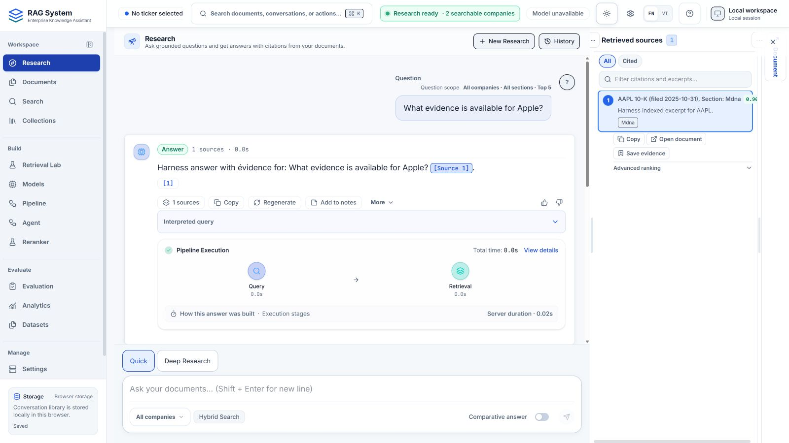
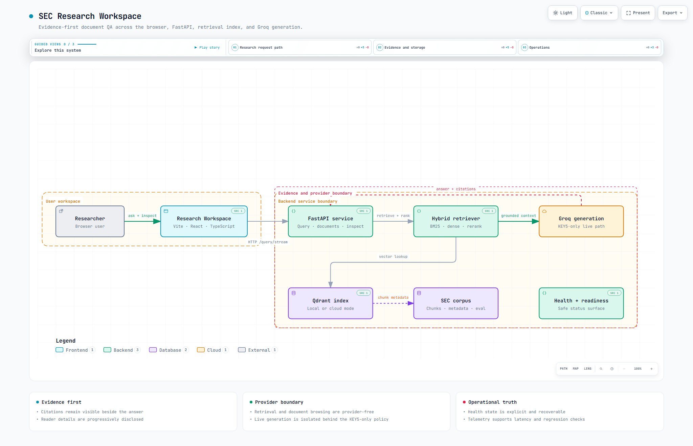

# Evidence-Grounded SEC Filing Research with Hybrid RAG & Durable AI Agents - FilingScope


[](https://github.com/NamTV2712/Enterprise-Document-QA-/actions/workflows/backend.yml)
[](https://github.com/NamTV2712/Enterprise-Document-QA-/actions/workflows/frontend.yml)
[](LICENSE)

[Live Demo](https://frontend-one-gamma-f9jf11u8ec.vercel.app) ·
[Watch Demo](https://github.com/NamTV2712/Enterprise-Document-QA-/releases/tag/demo-v1) · [Architecture](#architecture) ·
[Case Study](docs/PORTFOLIO_CASE_STUDY.md) · [Setup](#local-setup)

Research SEC **10-K filings** while keeping the evidence behind each answer
inspectable. **Quick Research** streams cited answers; **Deep Research** runs
one bounded AI Agent with durable progress, evidence, results and cancellation.

**Hybrid RAG:** BM25 + semantic vector search in Qdrant → RRF → cross-encoder
reranking → evidence-grounded generation. Built with Python, FastAPI/SSE,
React/TypeScript and SQLite; configured generation uses Groq.

## Live Demo

[Open the frontend preview](https://frontend-one-gamma-f9jf11u8ec.vercel.app).
The 2026-10-03 audit observed **API offline**: questions need the owner's backend
and tunnel online. Private Deep execution requires an explicitly connected local
workspace; the Vercel preview alone does not provide it.

[**Watch Demo — 2:28 silent functional tour**](https://github.com/NamTV2712/Enterprise-Document-QA-/releases/tag/demo-v1) · [Download MP4](https://github.com/NamTV2712/Enterprise-Document-QA-/releases/download/demo-v1/filingscope-portfolio-demo.mp4) · [Demo Guide](docs/DEMO_SCRIPT.md)

The **two-company / four-chunk fixture** demonstrates real HTTP/SSE, SQLite,
workers and cancellation with synthetic corpus, ranking, generation and Agent
decisions. The separate successful run is prepared in advance. It demonstrates
product behavior; it does not establish live financial-model accuracy.

[](https://github.com/NamTV2712/Enterprise-Document-QA-/releases/tag/demo-v1)

Real 16:9 product capture. The application retains its historical **RAG System**
header; FilingScope is the public project name. Narration was omitted at the
owner's request.

## Quick vs Deep Research

Filings spread facts across narrative, tables and reporting periods. Quick
answers a question against selected evidence; Deep keeps a bounded execution
record for a research goal.

| | Quick | Deep Research |
|---|---|---|
| Start | Submit a question or follow-up | Explicitly submit a research goal |
| Work | Retrieval, reranking, streamed generation | One Agent choosing from four typed tools |
| Inspect | Answer citations and source excerpts | Activity, final references, evidence and terminal evaluation |
| Persist | On-device conversation; transient server session | SQLite run, ordered events and result; browser stores a run reference |
| Cancel | Stop the answer stream at supported boundaries | Request cancellation; terminal acknowledgement at a safe boundary |
| Access | Public RAG with configured limits | Local connection, execution capability and per-run decision-provider consent |

**Research deeper** fills a visible Deep draft; it does not submit a run.
The generic composer submits goal and locale, without inheriting Quick
history/filters or inventing a hidden multi-objective plan. Reload clears the
memory-only local connection; reconnect to inspect the same durable run.

<a id="architecture-at-a-glance"></a>

## Architecture



This validated system view depicts the RAG path. Its historical title is
**SEC Research Workspace**; `KEY5-only` names the retained primary-only credential
policy, not a fifth current key. Durable Agent ownership is described below and
in the [full architecture](ARCHITECTURE.md).

**Quick:** React → FastAPI/HTTP/SSE → BM25 + vector retrieval → RRF →
cross-encoder → bounded evidence → grounded answer and citations.

**Deep:** Agent API → SQLite authority → two fixed process-local workers →
one bounded Agent → closed tools → durable evidence and result.

The tools are `search_documents`, `inspect_retrieval`, `read_document` and
`ask_rag`. They reuse existing services in-process. Strict inputs and capability
policies gate invocation; decision-provider permission and RAG-provider permission
are separate. Retrieved text remains untrusted data.

[System Architecture](docs/architecture/sec-research-workspace.html) ·
[Query Data Flow](docs/architecture/sec-research-query.html) ·
[Research Workflow](docs/architecture/sec-research-workflow.html)

Download/open interactive HTML locally; GitHub's file view does not execute it.

### Engineering highlights

- **Evidence continuity:** canonical document/chunk identities follow context,
  citations and source inspection. Acquisition, indexing and reader admission
  are separate; unavailable originals stay visible.
- **Durable execution:** short revisioned SQLite writes own runs and ordered
  events. Provider work happens outside transactions. On restart, uncertain
  claimed work becomes interrupted instead of replaying external effects.
- **Bounded concurrency:** fixed consumers claim durable jobs; a payload-free
  admission hint reduces idle delay while polling remains the fallback.
- **Inspectable evaluation:** frozen evidence bindings support offline RAG
  reproduction. Agent terminal evaluation reports 21 structural/operational
  entries separately. Neither surface defines an overall AI score.
- **Safe attribution:** optional content-free timings separate API, database,
  worker, tool and provider stages without recording goals, answers or credentials.

The [case study](docs/PORTFOLIO_CASE_STUDY.md) explains the tradeoffs;
the [interview guide](docs/INTERVIEW_GUIDE.md) links design decisions to evidence.

## RAG quality

**Controlled development benchmark:** `filingscope-rag-public-v1`, all **30**
historical priority `<=2` cases. Native v1 recomputation reuses frozen answers,
exact evidence and verified judge scores; **zero live provider calls** for publication.

| Metric | Result | Computed / total |
|---|---:|---:|
| Faithfulness | 1.0000 | 30 / 30 |
| Answer relevancy | 0.9917 | 30 / 30 |
| Context precision | 0.7613 | 30 / 30 |
| Citation index validity | 1.0000 | 27 / 30 |
| Keyword recall proxy | 1.0000 | 24 / 30 |
| Fallback correctness | 1.0000 | 30 / 30 |

Three citation cases and six keyword cases are N/A; none is unavailable or
converted to zero. Historical context packing uses required-keyword donors:
**label-assisted, not fully label-blind; not current-runtime or general SEC QA
accuracy**. Citation validity is structural, keyword coverage is not Recall@K,
and judge estimates are not probabilities. No overall score.

[Scope, provenance, limitations and safe reproduction](docs/RAG_QUALITY_BENCHMARK.md).
Agent's 21 terminal metrics describe recorded execution structure, not these RAG scores.

<a id="system-performance"></a>

## Measured results

**Controlled local/development workloads, not production SLA results.**

| Measurement | Recorded p95 | Evidence |
|---|---:|---|
| Read50 HTTP/SQLite client | 1967.995 → 982.813 ms | [DB-SCALE](docs/DB_SCALE_001_FINAL_RECEIPT.md) |
| Idle-confirmed Agent queue | 502.753 → 9.340 ms | [Worker wake](docs/WORKER_002_FINAL_RECEIPT.md) |
| Warm navigation | Chromium 63.30 / Firefox 42.00 ms | [Frozen release](docs/IMPROVEMENT_FINAL_RECEIPT.md) |

Read50 reports median trial statistics with synthetic dependencies. Queue results
use two workers and a 500ms polling fallback. Navigation uses 30 observations per
engine. These measure different stages and populations; saturated queues and mixed
admission contention remain. [Capacity findings](docs/CAPACITY_001_FINAL_RECEIPT.md)
include workloads where more workers did not help.

**Corpus reference:** 50 configured companies, 10,053 canonical local chunks;
46 filings cover all four target sections, four remain degraded but searchable,
and financial-table chunks exist for all 50. These documented index facts are
separate from the 30-case benchmark and small demo fixture. Data is not bundled
with a clean clone. [Coverage and provenance](docs/ENGINEERING_REFERENCE.md#supported-corpus).

## Validation

Recorded gates for frozen code release
[`cbaacc3765f8dbca2ff04247cb24fd773751a0f9`](https://github.com/NamTV2712/Enterprise-Document-QA-/commit/cbaacc3765f8dbca2ff04247cb24fd773751a0f9):

| Gate | Recorded result |
|---|---|
| Backend | 1958 primary passes; clean checkout 1924 passes + 34 artifact-dependent skips |
| Frontend | 96 Vitest files / 844 tests; TypeScript and production build PASS |
| Chromium / Firefox matrix | 542 passes, 4 inherited skips, 0 failures |
| Separate HTTP/SSE / Agent shell / durable Agent gates | 16 / 32 / 12 passes |
| Exact code-release CI | [Backend SUCCESS](https://github.com/NamTV2712/Enterprise-Document-QA-/actions/runs/37085104945) / [Frontend SUCCESS](https://github.com/NamTV2712/Enterprise-Document-QA-/actions/runs/37085104875) |

These are frozen release results, not fresh tests of a documentation change.
Skips are not passes; backend warnings remain (188 primary, 149 clean).
[The receipt](docs/IMPROVEMENT_FINAL_RECEIPT.md) records provenance and gate scopes.
Browser/contrast checks do not imply blanket accessibility certification.
Hermetic tests use deterministic dependencies without live SEC/Groq calls.

## Tech stack

| Layer | Technologies |
|---|---|
| Retrieval / generation | Sentence Transformers, BM25, Qdrant, RRF, cross-encoder, Groq |
| Backend / authority | Python, FastAPI, SSE, Pydantic, SQLite |
| Frontend | React 19, TypeScript, Vite, Tailwind CSS, Bun 1.3.14 |
| Verification | pytest, Vitest, Playwright, GitHub Actions |

## Local Setup

- **Repeatable demo:** follow the [provider-free recording environment](docs/DEMO_SCRIPT.md#off-camera-preparation).
  No real `.env`, SEC corpus, Groq key or model download is needed.
- **Product:** follow [Setup and Operations](docs/SETUP.md) for Python/Node
  installation, corpus/index provenance, API/frontend startup and explicit local
  Deep access. Qdrant local mode requires one API worker.
- **Deployment:** backend and frontend are independent. See the
  [release runbook](docs/LOCAL_RELEASE_RUNBOOK.md) and
  [Vercel/frontend instructions](frontend/README.md). Browser `VITE_*` values
  must not contain secrets.

Offline public benchmark reproduction, from the repository root:

```powershell
.venv\Scripts\python.exe -m scripts.reproduce_rag_public_benchmark --check
```

## Limitations

- **Evidence is inspectable, not guaranteed correct.** Check filing identity,
  period, units and supporting passages; extraction coverage is uneven.
- **Deep is bounded and single-process.** Ordinary worker recommendation is 1–2;
  no distributed execution, production SLA or real Groq quota certification.
- **Access and availability matter.** Public RAG is unauthenticated with configured
  limits; private execution requires loopback/Host/Origin/bearer controls. The
  public preview can stay online while its backend is offline.
- **Sessions and integrations have limits.** Server conversation/cache state is
  transient. Reload requires local reconnect. Collections/model-test browser
  bearer wiring remains staged; Ragas is optional and native evaluation authoritative.
- **Known validation gaps remain.** Native zoom at 125/150/200% is manual/unverified;
  the ~527.24 kB main bundle warning and backend dependency warnings remain.

[Detailed limitations](docs/ENGINEERING_REFERENCE.md#known-limitations) ·
[Case study tradeoffs](docs/PORTFOLIO_CASE_STUDY.md#tradeoffs-and-limitations)

## Detailed documentation

- **Understand:** [Case Study](docs/PORTFOLIO_CASE_STUDY.md),
  [Architecture](ARCHITECTURE.md), [Interview Guide](docs/INTERVIEW_GUIDE.md).
- **Reproduce:** [RAG Quality Benchmark](docs/RAG_QUALITY_BENCHMARK.md),
  [Demo Guide](docs/DEMO_SCRIPT.md), [Setup](docs/SETUP.md).
- **Inspect:** [Engineering Reference](docs/ENGINEERING_REFERENCE.md),
  [release evidence](docs/IMPROVEMENT_FINAL_RECEIPT.md),
  [frontend contracts](docs/frontend/FRONTEND_CONTRACT.md).
- **Browse:** [Documentation index](docs/README.md), [Project journal](PROJECT_STATE.md),
  [Security policy](SECURITY.md), [Agent operating guide](AGENTS.md).

## License

Project source and documentation use the [MIT license](LICENSE).
External SEC content and dependencies retain their own terms. Bundled tooling
retains [Archify's MIT notice](.agents/skills/archify/LICENSE),
[third-party notices](.agents/skills/archify/THIRD_PARTY_NOTICES.md) and
[source provenance](.agents/skills/SOURCES.md).

<!-- Historical README links resolve here; detailed sections are preserved in the engineering reference. -->
<a id="enterprise-document-qa"></a>
<a id="why-this-project-exists"></a>
<a id="what-it-does"></a>
<a id="measured-engineering-improvements"></a>
<a id="current-boundaries"></a>
<a id="continuous-integration"></a>
<a id="running-with-docker"></a>
<a id="qdrant-cloud"></a>
<a id="zero-cost-public-demo"></a>
<a id="overview"></a>
<a id="documentation"></a>
<a id="current-v5-research-workbench"></a>
<a id="provenance-bound-pdf-representation"></a>
<a id="supported-corpus"></a>
<a id="api-endpoints"></a>
<a id="retrieval-design"></a>
<a id="generation-design"></a>
<a id="repository-structure"></a>
<a id="data-and-secrets"></a>
<a id="engineering-notes-and-evidence"></a>
<a id="start-here--current-product"></a>
<a id="evaluation-results"></a>
<a id="financial-table-unit-preservation--canonical-rebuild-complete"></a>
<a id="comparative-answerability-guard-v1--non-official-no-go"></a>
<a id="comparative-evidence-contract-v2--non-official-no-go"></a>
<a id="evidence-contract-v3--provider-incomplete--no-go"></a>
<a id="frontend-workspace-ux-and-themes"></a>
<a id="evaluation-analytics-and-quota-safe-campaign-handoff"></a>
<a id="historical-evaluation-log"></a>
<a id="historical-retrieval-and-packing-milestones"></a>
<a id="performance-notes"></a>
<a id="current-status"></a>
<a id="known-limitations"></a>
<a id="roadmap"></a>
<a id="why-this-project-matters"></a>
<a id="skill-governance"></a>
<a id="product-overview"></a>
<a id="key-features"></a>
<a id="technical-reference"></a>
<a id="retrieval-generation-and-api"></a>
<a id="evaluation-and-evidence"></a>
<a id="1-install-the-backend"></a>
<a id="2-prepare-searchable-artifacts"></a>
<a id="3-start-the-api-and-frontend"></a>
<a id="4-enable-local-deep-research-explicitly"></a>
<a id="5-docker-cloud-and-public-frontend"></a>
<a id="6-run-local-checks"></a>
