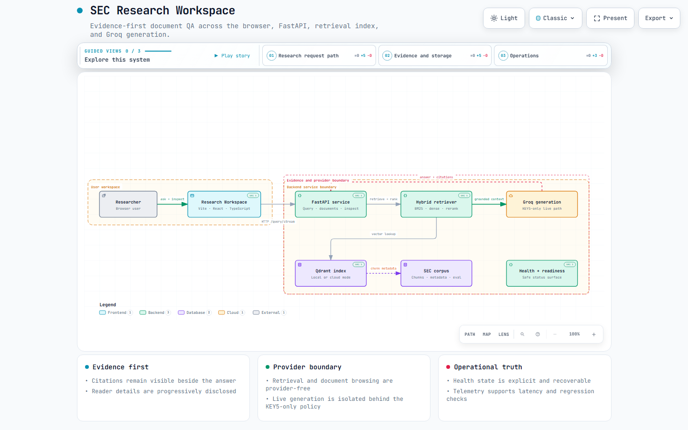

# Enterprise Document QA

Public `/system/info` exposes bounded model/build identifiers, not local model
paths or credential-shaped configuration values. Unsafe model identifiers are
reported as null; unsafe build identifiers are omitted.


[](https://github.com/NamTV2712/Enterprise-Document-QA-/actions/workflows/backend.yml)
[](https://github.com/NamTV2712/Enterprise-Document-QA-/actions/workflows/frontend.yml)

Enterprise Document QA is a production-style Retrieval-Augmented Generation application for answering grounded questions over SEC 10-K filings.
The system ingests a 50-company filing corpus, extracts key sections and financial tables, builds a hybrid search index, and serves cited financial answers through a Vite/React research workspace backed by FastAPI streaming, semantic caching, multi-turn memory, and query decomposition.

## Start here — current product

The independent frontend exposes Chat, Research, Documents, Search, Collections,
Retrieval, Models, Pipeline, Agent, Reranker, Evaluation, Analytics, Datasets,
Settings, and Logs. FastAPI supplies public catalog/search/inspection/report reads; opt-in
local mode adds a private SQLite workspace, queued Pipeline staging, frozen
native Evaluation jobs, and content-free operational telemetry. Pipeline staging
does not execute or promote the canonical corpus. Browser conversations and
presentation preferences have separate on-device storage.

From a clean source checkout, install Python dependencies as described in
[Local Setup](#local-setup), then start the backend and frontend in separate
terminals (PowerShell examples):

```powershell
.venv\Scripts\python.exe -m uvicorn src.api.app:app --reload --port 8000
```

```powershell
cd frontend
bun install --frozen-lockfile
bun run dev
```

Set `frontend/.env.local` from `frontend/.env.example` with
`VITE_API_BASE_URL=http://localhost:8000`. Browser `VITE_*` values must never
contain secrets. A data-free checkout can import the API and run the hermetic
tests, but corpus-backed retrieval/answers need local `data/` artifacts and
configured models; live generation additionally needs the documented
server-side Groq configuration. No `.env` or `data/` is needed for the
deterministic TEST-004 product harness.

The default `WORKSPACE_MODE=public` does not open the private database. For
local mode, configure a dedicated `LOCAL_WORKSPACE_TOKEN` (at least 32
non-whitespace characters), loopback Host/Origin allowlists and, only for
execution, `ENABLE_WORKSPACE_EXECUTION=true`. Enter the token in the app's
Connection control: the shared Pipeline/Evaluation/Analytics/Logs/Settings
session holds it only in memory and loses it on reload. The ordinary
Collections and model-test browser wrappers are not yet connected to that
bearer owner; their refusal states are intentional, not an auth bypass.

Core checks are `.venv\Scripts\python.exe -m pytest tests -q --tb=short` at
the root and `bun run lint`, `bun run test`, `bun run build` under `frontend/`.
`bun run test:e2e-product` uses real FastAPI public/local handlers and temporary
SQLite with deterministic corpus/provider doubles; it is not a live-provider or
load test. See [frontend setup](frontend/README.md), [architecture](ARCHITECTURE.md),
[current state](PROJECT_STATE.md), and the [final product receipt](docs/TEST_004_FINAL_PRODUCT_RECEIPT.md).
The required UI rebuild roadmap is complete through UI-013; EVAL-004/Ragas is
optional, not a missing native-evaluation prerequisite.

The optional Agent extension includes typed in-process research tools, one
bounded single-Agent orchestrator, private DATA-004 durable runs, and an
optional bounded research policy. Research runs freeze up to six explicit
objectives, gather canonical evidence across existing tools, track gaps and
validate current-run citations before synthesis. Agent observations reject
conflicting document/chunk source identities when the IDs encode a
recognizable ticker or SEC filing accession. Invalid structured evidence ends
the run with a typed `invalid_observation` result instead of entering the
research ledger. The AGENT-005 adversarial checkpoint is documented in
[the extension plan](docs/AGENT_EXTENSION_PLAN.md). The Agent run routes
support queued creation, detail, results, ordered finite SSE events and
revision-safe cancellation. Create and cancel require local execution access;
reads require local bearer access. PROVIDER-001 adds a production Groq strict
JSON Schema decision adapter for `openai/gpt-oss-120b` and `openai/gpt-oss-20b`.
It reuses the generator default or loaded model identity and existing
`GROQ_KEY_POLICY`/Groq credentials. Unsupported models or absent eligible keys
remain `decision_provider_unavailable` without tool calls. The private
`/agent` page reads durable runs, safe activity, research evidence and the
native metric report after an explicit memory-only local connection. It can
create a real recorded run when execution is enabled. The existing protected
`/system/configuration-status` reports provider capability without contacting
Groq. The create form requires explicit decision-provider consent; RAG tool
provider permission remains separate and disabled in the form. New runs freeze
safe provider/model/adapter/mechanism/key-policy provenance; changed bindings
fail closed and historical unconfigured runs retain their original identity.
The SDK makes one attempt per decision, with retries disabled, a 60 second
total deadline and five second connect timeout. Cancellation waits for the
existing safe boundary; restart never replays a claimed call. Strict format
does not prove answer quality or model resistance to injected text: existing
tool, evidence, objective and budget checks remain authoritative. No reasoning
or raw transport payload is persisted. There is no multi-agent behavior.
See [the provider plan](docs/AGENT_PRODUCTION_PROVIDER_PLAN.md) and [the extension plan](docs/AGENT_EXTENSION_PLAN.md)
for research bounds, partial results and recovery.

CRED-001 consolidates server-side Groq configuration to one primary and one
optional fallback. The historical `key5_only` identifier retains frozen Agent
bindings and now selects primary only. See [Local Setup](#local-setup) and the
[credential receipt](docs/CRED_001_FINAL_RECEIPT.md) for migration and compatibility
checks; no live provider call or remote key revocation was required.

SCALE-001 moves durable Agent execution to one application-lifespan worker pool.
`POST /agent/runs` returns the accepted queued record (201 and its revision),
independently of execution or client disconnect. The pool atomically claims
only `agent / bounded_agent_run` from DATA-004 SQLite, oldest creation timestamp
then job ID first. Two fixed asyncio workers are the default; queued rows do
not allocate execution tasks. Startup requires `WORKSPACE_MODE=local`,
`ENABLE_WORKSPACE_EXECUTION=true` and `WORKSPACE_WORKER_ENABLED=true`.
Disabling workers leaves Agent work queued. Public mode starts no private worker
and opens no private database. Model/provider resolution occurs after claim;
the frozen decision and RAG grants still control execution independently.

Worker settings are server-side: `WORKSPACE_WORKER_CONCURRENCY` (1–16, default
2), `WORKSPACE_WORKER_POLL_INTERVAL_MS` (100–5000, default 500), and
`WORKSPACE_WORKER_SHUTDOWN_GRACE_MS` (100–60000, default 5000). Shutdown stops
new claims and grants active owners the configured grace; unresolved execution
then becomes interrupted. Short SQLite claims/reconciliation finish within the
existing busy-timeout discipline and are never abandoned after possible commit.
An in-flight Python thread or provider effect cannot be forcibly killed; late
output is discarded and no external effect is automatically replayed. Restart
interrupts claimed running/cancelling work, while never-claimed queued Agent
work remains eligible. This is one-process execution, not distributed or
exactly-once external execution. Pipeline stays staging-only, Evaluation keeps
its existing EVAL-003 response-attached executor/receipts, and model identity
tests stay synchronous/provider-free. Existing readiness additionally reports
the safe `worker_ready` flag while the pool exists and returns 503 if a worker
dies. See [the separate scaling roadmap](docs/SCALING_ROADMAP.md).

SCALE-002 records measured development capacity using real HTTP/workers/SQLite
with mocked provider transport. See the [load characterization receipt](docs/SCALE_002_FINAL_RECEIPT.md)
and [reproducible protocol](docs/SCALE_002_BENCHMARK_PROTOCOL.md) for environment,
workloads, saturation evidence and limitations. No production SLA is certified.

The provider-free `native-agent-evaluation` v1 protocol evaluates an existing
terminal Agent run from its frozen plan, safe events and durable result. It
returns separate versioned execution, tool, budget, evidence and research
metrics with `computed`, `unavailable` and `not_applicable` states, plus a
canonical report digest. It neither reruns the Agent nor judges factual
correctness, and it exposes no overall Agent score. Reports are computed
through one private read-only `GET /agent/runs/{run_id}/evaluation` route for
terminal runs. No report storage is added; active runs return 409, and an
inconsistent snapshot fails closed.

The optional Agent extension has a final cross-layer validation receipt in
[TEST-005](docs/TEST_005_AGENT_FINAL_RECEIPT.md). It exercises the built
frontend against real FastAPI Agent routes and temporary SQLite in Chromium
and Firefox, alongside the closed-tool, lifecycle, adversarial, evaluation,
access and data-free checkout gates. The scripted successful research model
is test-only. The subsequent optional PROVIDER-001 extension has its own
mocked-transport verification and provider plan; TEST-005 remains a completed
historical baseline.

## Overview

- Problem type: enterprise document question answering over financial filings.
- Corpus: latest SEC 10-K filings for 50 configured tickers; all 50 currently have searchable embedded chunks.
- Serving style: FastAPI REST API with non-streaming and Server-Sent Events streaming responses.
- Retrieval stack: BM25 keyword search, Qdrant semantic search, Reciprocal Rank Fusion, and cross-encoder re-ranking.
- Generation stack: strict source-grounded LLM prompting with citations and insufficient-context fallback.
- Conversation support: session-based memory plus query rewriting for follow-up questions.
- Complex-query support: LLM query decomposition for comparative and enumeration-style questions.
- Evaluation: LLM-as-judge scoring for faithfulness, answer relevancy, and context precision.

## Documentation

Nine-reference visual validation and bounded accessibility repairs are recorded
in [`docs/TEST_003_VISUAL_RECEIPT.md`](docs/TEST_003_VISUAL_RECEIPT.md).
All nine native references were reviewed in Chromium/Firefox; dark/light and
English/Vietnamese responsive checks passed. Source cards never invent page
locations for unlocated excerpts. Native browser zoom remains a manual,
unverified check; this receipt is not blanket accessibility certification.

Cross-layer contract validation and its bounded repairs are recorded in
[`docs/TEST_002_CONTRACT_RECEIPT.md`](docs/TEST_002_CONTRACT_RECEIPT.md).
Search snippet ranges are half-open Unicode code-point offsets into the original
returned text, not casefolded text or JavaScript UTF-16 offsets. Private
Collection-list refusal is distinct from an unknown collection record.

| Document | Purpose |
|---|---|
| [`README.md`](README.md) | Public overview, setup, API contract, benchmark, and deployment instructions |
| [`ARCHITECTURE.md`](ARCHITECTURE.md) | Stable component boundaries, data and request flows, state ownership, and extension paths |
| [`PROJECT_STATE.md`](PROJECT_STATE.md) | Living engineering journal, measured decisions, rejected experiments, and current milestone state |
| [`TODO.md`](TODO.md) | Optional post-roadmap deployment, diagnostics, and evidence-gated backlog work |
| [`AGENTS.md`](AGENTS.md) | Stable repository rules and operational traps for coding agents |
| [`frontend/README.md`](frontend/README.md) | Frontend-specific local development, Vercel setup, and API usage |
| [`docs/LOCAL_RELEASE_RUNBOOK.md`](docs/LOCAL_RELEASE_RUNBOOK.md) | Provider-free local Docker build, smoke test, provenance, and receipt |
| [`docs/ARCHITECTURE_API_GUIDE.md`](docs/ARCHITECTURE_API_GUIDE.md) | Retrieval flow, read-only API surfaces, and frontend state boundaries |
| [`docs/IMPROVEMENT_ROUND_REPORT.md`](docs/IMPROVEMENT_ROUND_REPORT.md) | M0-M11 improvement receipt, provider accounting, and final verification gates |
| [`docs/UX_IMPROVEMENT_ROUND_REPORT.md`](docs/UX_IMPROVEMENT_ROUND_REPORT.md) | P0-P14 SEC Research Workspace UX, performance, Archify, and KEY5 receipt |
| [`docs/frontend/V5_WORKBENCH_CONTRACT.md`](docs/frontend/V5_WORKBENCH_CONTRACT.md) | V5-00 through V5-08 workbench contract, ownership, responsive geometry, and validation receipts |
| [`docs/EVALUATION_REVIEW_GUIDE.md`](docs/EVALUATION_REVIEW_GUIDE.md) | Evaluation and experiments workflow for live, recorded, and missing reports |
| [`docs/TEST_004_FINAL_PRODUCT_RECEIPT.md`](docs/TEST_004_FINAL_PRODUCT_RECEIPT.md) | Final real-HTTP product, clean-checkout, browser, and limitation evidence |
| [`docs/frontend/FRONTEND_CONTRACT.md`](docs/frontend/FRONTEND_CONTRACT.md) | Current route, state, private-client, and reader contracts |
| [`docs/frontend/DESIGN.md`](docs/frontend/DESIGN.md) | Current visual and responsive design contract |

## Key Features

| Area | Capability |
|---|---|
| Filing ingestion | SEC EDGAR client with CIK lookup, rate limiting, and filing download |
| Section extraction | Robust extraction for `business`, `risk_factors`, `mdna`, and `financial_statements` |
| Chunking | Token-aware recursive chunking with larger chunks for financial statements |
| Financial tables | Table extraction plus structured lookup for total assets, liabilities, revenue, equity, and auditor signatures |
| Embeddings | Local embeddings via `nomic-ai/nomic-embed-text-v1.5` |
| Vector search | Persistent local Qdrant collection with deterministic point IDs |
| Hybrid retrieval | BM25 + dense retrieval + RRF + cross-encoder re-ranking |
| RAG generation | Grounded answer generation with source citations and fallback behavior |
| API | FastAPI service with Swagger UI and SSE streaming |
| Cache | Filter-aware semantic response cache for repeated stateless queries |
| Memory | Multi-turn backend memory, query rewriting, and a searchable local conversation library with bookmarks, Markdown export, and versioned JSON backup/restore |
| Decomposition | Comparative and enumeration queries decomposed into focused sub-queries |
| Evaluation | Native v1 definitions, validated publications, backend-owned comparison/trends/failures, and protected frozen jobs |
| Research workspace | Vite/React interface with searchable company and section controls, English/Vietnamese UI and answer selection, streaming answers, measured request-stage traces when the backend provides them, conservative source-bound financial metric cards when the retrieved evidence supports them, a first-class Sources pane and shared Document pane backed by indexed excerpts with exact chunk/hash/revision synchronization across Structured, Normalized text, and an optional provenance-bound PDF representation, canonical evidence deep links, accent-insensitive evidence inspection with per-panel search and copy, per-answer bookmarks, feedback, private notes, local evidence collections, a reliable conversation Library, JSON backup/restore, session context status, glossary/help, research templates, command palette, keyboard shortcuts, lazy tool panels, and responsive Light/Dark themes |
| Research tools | Provider-free Retrieval Lab for BM25/dense/RRF/reranker trace inspection with preset comparison and JSON/CSV export, read-only Document Explorer with filing/chunk search, Search workspace, native Evaluation definitions/public analytics plus memory-gated frozen jobs, truthful Models and Datasets registries over configured/runtime identity plus corpus/evaluation provenance, an isolated Pipeline staging workspace, server-backed local-workspace Analytics, System & provenance metadata without filesystem paths or secrets, and three lazy-loaded Archify diagrams under Architecture |
| Conversation UX | Separate Overview and Conversation views, responsive 216px wide/56px compact desktop navigation, mobile workspace navigation, bounded answer cards, contextual scope controls beside the composer, and interpreted-query metadata |

The frontend's document reader caches indexed chunk details for five minutes
with in-flight deduplication and a 100-entry bound. The production browser
gate covers Chromium and Firefox responsive states from 320px through desktop,
reduced-motion behavior, keyboard/focus flows, color contrast, and measured
input/search performance against the local fixture API.

### Current V5 research workbench

The V5 frontend is now an integrated SEC research workbench. At the measured
wide targets, Research, citation-ordered Sources, and the shared Structured /
Normalized Document surface are simultaneous bounded panes. The layout uses
compact 56px navigation below 1600px and expanded 216px navigation at larger
desktop widths, with context-dock, contextual-surface, drawer, and
single-surface fallbacks selected from actual width and height. Documents,
Search, Retrieval Lab, and Library hand off typed document/evidence targets and
restore the exact invoking action. Exact chunk/hash/revision mismatches remain
truthful unavailable or stale states. The optional PDF tab uses a real PDF.js
viewer only when the backend exposes a current `DERIVED_PDF` or trusted
`OFFICIAL_PDF` manifest; it never turns a missing PDF into fabricated pages or
changes backend retrieval, generation, corpus, or index behavior.

### Provenance-bound PDF representation

The PDF surface is a document representation, not a new evidence identity. A
generated artifact is bound to `document_id`, source-document identity,
source-set/document revisions, the exact admitted normalized text hash, and a
frozen renderer profile. The current local corpus contains HTML/HTM sources and
does not currently admit official PDF bytes, so the live path is an explicitly
labeled `DERIVED_PDF` generated on demand from the verified local source.

Generated page numbers mean generated-representation pages. The backend exposes
document-bound status, generation, content, mapping, and exact location routes;
the browser cannot submit a URL, filesystem path, or HTML body. Highlights are
painted only when the source chunk/hash/revisions match and the mapping proves
complete rendered block boundaries. Ambiguous, stale, missing, or unsupported
locations remain visible as truthful fallback states.

The controlled renderer is the backend's fixed ReportLab text renderer (profile
`reportlab-4.2.5`), with escaped plain text, bounded generation, atomic
hash-bound storage, and PDF.js for browser viewing. It is intentionally not an
official SEC pagination claim; official-PDF admission remains a separate
trusted-source path.

## Architecture

See [`ARCHITECTURE.md`](ARCHITECTURE.md) for component boundaries, request flows,
state ownership, reliability controls, deployment constraints, and extension
paths. The source-controlled diagrams below are rendered from Archify IR and
are also available as standalone interactive viewers:

- [System architecture](docs/architecture/sec-research-workspace.html)
- [Query data flow](docs/architecture/sec-research-query.html)
- [Research workflow](docs/architecture/sec-research-workflow.html)

[](docs/architecture/sec-research-workspace.html)

```text
SEC 10-K Filing
  -> HTML-to-Text Conversion
  -> Section Extraction
  -> Token-Aware Chunking
  -> Local Embeddings
  -> Qdrant Vector Index + BM25 Index
  -> Query Rewrite for Follow-ups
  -> Query Decomposition for Complex Questions
  -> Hybrid Retrieval + Reciprocal Rank Fusion
  -> Cross-Encoder Re-ranking
  -> Semantic Cache / Conversation Memory
  -> Grounded LLM Answer Generation
  -> FastAPI REST API / SSE Streaming
```

## Supported Corpus

The configured corpus targets 50 latest 10-K filings:

```text
AAPL, MSFT, AMZN, GOOGL, META, NVDA, TSLA,
JPM, BAC, GS, MS, BRK-B,
JNJ, UNH, PFE,
WMT, HD, MCD,
XOM, CVX,
AMD, INTC, QCOM, AVGO, TXN,
CRM, ORCL, NOW, IBM,
V, MA, AXP,
LLY, MRK, ABBV, TMO,
PG, KO, PEP, COST, NKE,
CAT, GE, BA, LMT, HON, UPS, RTX,
VZ, T
```

Current searchable corpus:

- All 50 configured tickers have embedded chunks in local Qdrant.
- Annual-report layout recovery covers `MS`, `MCD`, `INTC`, `COST`, `GE`,
  and `HON`; the FY2026 recovery pass additionally restored
  `financial_statements` for `NOW`, `NVDA`, `ORCL`, and `PEP` plus `mdna`
  for `PFE`.
- Local Qdrant indexes `10,053` chunks from trusted generation
  `nomic-e9b6763-fy2026-ibm-companion-20260829`.
- Extraction quality is `46` filings with all four target sections and
  `4` degraded but searchable filings (`CVX`, `IBM`, `JPM`, `XOM`).
- `financial_table` chunks are available for all `50` searchable tickers; CVX,
  JPM, and XOM use verified same-document statement intervals, while IBM uses
  its uniquely linked, page-bounded Annual Report companion.

The `/supported-tickers` endpoint returns the live searchable ticker list from embedded chunks, not the full configured list.

When the pipeline is ready, `/health` and `/health/ready` also expose a
`corpus` object with `searchable_company_count` and `indexed_chunk_count`.
These values are informational and are used by the frontend to avoid showing
hardcoded corpus statistics.

## API Endpoints

Run the API locally:

```powershell
.venv\Scripts\python.exe -m uvicorn src.api.app:app --reload --port 8000
```

Swagger UI:

```text
http://localhost:8000/docs
```

| Method | Endpoint | Purpose |
|---|---|---|
| `GET` | `/health/live` | Process liveness |
| `GET` | `/health/ready` | Pipeline readiness; returns `503` until ready |
| `GET` | `/health` | Legacy frontend-compatible readiness payload |
| `POST` | `/query` | Non-streaming RAG answer |
| `POST` | `/query/stream` | SSE streaming RAG answer |
| `POST` | `/query/decomposed` | Comparative or complex RAG answer |
| `GET` | `/supported-tickers` | Supported tickers and sections |
| `POST` | `/retrieval/inspect` | Provider-free retrieval-stage trace for BM25/dense/hybrid/rerank |
| `GET` | `/documents` | Paginated loaded-filing catalog with safe filters |
| `GET` | `/documents/{document_id}` | One safe document metadata record |
| `GET` | `/documents/{document_id}/chunks` | Paginated source previews for a loaded filing |
| `GET` | `/chunks/{chunk_id}` | Full safe source text and metadata for one indexed chunk; filesystem paths are never returned |
| `GET` | `/system/info` | Allowlisted corpus, retrieval, and build metadata |
| `GET` | `/system/configuration-status` | Protected, redacted local-workspace capability status; unavailable in public mode |
| `GET` | `/models` | Public, provider-free registry of configured and observed generator, embedding, and reranker identities; optional `role` filter |
| `POST` | `/models/{model_id}/tests` | Local execution-gated runtime-identity check; never performs inference or a provider request |
| `GET` | `/datasets` | Public, provider-free serving-corpus and evaluation-test-set summaries; optional `kind` filter |
| `GET` | `/datasets/{dataset_id}` | Public dataset coverage and allowlisted provenance detail |
| `GET` | `/pipeline` | Public, provider-free registered ingestion definition and staging capabilities |
| `GET` | `/pipeline/runs` | Protected local-workspace history of staged ingestion runs |
| `POST` | `/pipeline/runs` | Execution-gated creation of an isolated, queued staging record |
| `GET` | `/pipeline/runs/{run_id}` | Protected local-workspace run, step, and artifact-reference detail |
| `POST` | `/pipeline/runs/{run_id}/cancel` | Execution-gated cancellation request requiring the current `If-Match` revision |
| `GET` | `/pipeline/runs/{run_id}/events` | Protected, ordered SSE event replay resumable with `Last-Event-ID` |
| `GET` | `/evaluation/runs` | List validated public evaluation summaries with safe filters |
| `GET` | `/evaluation/runs/{run_id}` | Read one validated public evaluation report |
| `GET` | `/evaluation/metrics` | Read provider-free native metric definitions and protocol capabilities |
| `GET` | `/evaluation/runs/{run_id}/results` | Read bounded, text-free native case results and denominators |
| `POST` | `/evaluation/compare` | Read-only baseline/candidate native report comparison |
| `GET` | `/evaluation/metrics/trends` | Read compatible published native observations without interpolation |
| `GET` | `/evaluation/failures` | Read bounded native failure facts and unavailable prerequisites |
| `GET` | `/evaluation/jobs` | Protected local list of frozen native evaluation jobs |
| `POST` | `/evaluation/jobs` | Execution-gated, idempotent creation and dispatch of a budgeted native job |
| `GET` | `/evaluation/jobs/{job_id}` | Protected state, frozen binding, budget, steps, and private report reference |
| `GET` | `/evaluation/jobs/{job_id}/results` | Protected private case inputs/results and native report aggregates |
| `POST` | `/evaluation/jobs/{job_id}/cancel` | Execution-gated cancellation request requiring the current `If-Match` revision |
| `GET` | `/evaluation/jobs/{job_id}/events` | Protected ordered SSE replay resumable with `Last-Event-ID` |
| `GET` | `/analytics/summary` | Protected 24-hour/7-day/30-day terminal request populations, exact rates/denominators, measured-duration percentiles, and terminal job counts |
| `GET` | `/analytics/timeseries` | Protected bounded UTC buckets for allowlisted request/job count or measured-duration metrics |
| `GET` | `/logs` | Protected cursor-paginated seven-day projection of sanitized terminal request and durable-job facts |
| `GET` | `/cache/stats` | Semantic cache metrics |
| `POST` | `/cache/clear` | Clear semantic cache when explicitly enabled |
| `POST` | `/cache/test` | Rate-limited query embedding comparison |
| `GET` | `/session/{session_id}/history` | Inspect conversation history |
| `DELETE` | `/session/{session_id}` | Clear one conversation session |

Registry responses use stable role/dataset IDs and keep configuration, runtime
load, and availability separate. A configured remote generator is not reported
as reachable without a provider probe; ordinary registry reads never make one.
Corpus counts reuse the document catalog statistics, while index provenance is
reported as degraded when its manifest is absent, invalid, or inconsistent.
Only allowlisted identifiers and credential-presence state are returned—API
keys, authorization values, cache/database paths, and developer paths are not
part of these contracts.

The current `/pipeline` definition is the provider-free `sec_10k_ingestion`
capability. `POST /pipeline/runs` accepts only registered ticker IDs and the
`isolated` staging profile; an exact request replay returns its existing
durable run. Staging records a queued DATA-004 job and the ordered
`download_filings`, `chunk_filings`, `add_table_chunks`, `embed_chunks`, and
`index_chunks` steps as pending. API-007 does not run those scripts, write the
canonical corpus or index, invoke providers, or promote a staged run to
serving. Local run reads require the authenticated workspace capability;
creation and cancellation additionally require workspace execution to be
enabled. Cancellation uses the response `ETag` as `If-Match`, and event reads
return a bounded replay that closes for reconnection from the last numeric
event sequence.

The frontend `/pipeline` page shows the public five-stage definition without a
credential. To inspect or stage local runs, explicitly connect using the
server-configured `LOCAL_WORKSPACE_TOKEN`; the browser verifies it against the
protected configuration-status endpoint and holds it only in app memory.
Disconnect or a full reload forgets it. The token is never placed in the URL
or browser storage. Staging is available only when the backend advertises
workspace execution (`ENABLE_WORKSPACE_EXECUTION=true`) and still creates a
queued record, not a running ingestion. The selected durable run uses
`/pipeline/runs/{run_id}`; the page reads its five server steps, bounded events,
and revision before offering cancellation. Public deployments and denied
local access show an unavailable state rather than an empty private history.

The two non-streaming query endpoints enforce a 60-second request timeout and return HTTP `504` when exceeded. Timed-out synchronous workers are abandoned so they cannot hold the response open, but Python cannot safely kill a thread already running; that worker may finish in the background and its result is discarded.

The three LLM query routes share per-IP limits of `10/minute` and `100/day`; decomposed queries also have a `5/minute` limit because each request can make multiple provider calls. `/cache/test` is limited to `10/minute`, and `/cache/clear` returns `403` unless `ENABLE_CACHE_CLEAR=true`. Limits use in-memory storage, matching the required single-worker local-Qdrant runtime. A multi-instance deployment must use shared rate-limit storage such as Redis.

Rate-limit identity uses the ASGI client address by default. When deploying behind a reverse proxy such as ngrok or a Docker gateway, set `TRUSTED_PROXY_CIDRS` to that proxy's comma-separated CIDR ranges (for example `203.0.113.0/24,10.0.0.0/8`). Only requests whose socket peer falls inside those ranges have `X-Forwarded-For` honored, and the header is then walked right-to-left past trusted hops to the first non-trusted client address. A malformed header, an untrusted peer, or an empty configuration all fall back to the socket peer, so direct clients cannot choose their rate-limit bucket by forging headers.

Session history returns the full stored assistant answer for each of the five retained turns, so reloading the frontend does not truncate earlier responses. LLM rewrite context already used the full stored messages independently of this API representation.

Example request:

```bash
curl -X POST "http://localhost:8000/query" \
  -H "Content-Type: application/json" \
  -d '{
    "question": "What was Apple total revenue in 2024?",
    "ticker": "AAPL",
    "section": "financial_table",
    "top_k": 5,
    "answer_language": "en"
  }'
```

Example multi-turn request:

```bash
curl -X POST "http://localhost:8000/query" \
  -H "Content-Type: application/json" \
  -d '{
    "question": "What are Apple main risk factors?",
    "ticker": "AAPL",
    "section": "risk_factors",
    "session_id": "demo-session-001"
  }'

curl -X POST "http://localhost:8000/query" \
  -H "Content-Type: application/json" \
  -d '{
    "question": "What about their revenue?",
    "session_id": "demo-session-001"
  }'
```

The second question is rewritten internally into a standalone retrieval query similar to:

```text
What is Apple's total revenue?
```

## Retrieval Design

The retriever combines lexical and semantic signals instead of relying on vector search alone.

| Stage | Role |
|---|---|
| BM25 | Finds exact financial terms, company names, and table labels |
| Qdrant semantic search | Finds conceptually relevant chunks using dense embeddings |
| Reciprocal Rank Fusion | Merges BM25 and semantic rankings without score normalization |
| Cross-encoder re-ranker | Re-scores fused candidates for final source ranking |

This design improved context precision and fixed a no-filter AWS query that previously returned Microsoft cloud context above Amazon evidence. High-confidence financial table lookups use structured row matching before final formatting, which promotes exact table evidence above semantically similar but wrong chunks.

## Generation Design

The generator uses a strict financial analyst prompt:

- Use only retrieved SEC filing context.
- Cite factual claims with `[Source N]`.
- Do not use general knowledge.
- Do not infer beyond the provided context.
- Quote numbers exactly as they appear in the retrieved context.
- For trends and comparisons, inspect all provided sources and quote every
  relevant period/value pair; do not answer with only a percentage when exact
  underlying values are available.
- Use only canonical `[Source N]` citations; line-number citation formats are
  invalid. Keep the fiscal period and sign attached to every numeric claim.
- Do not invent enumeration categories from general knowledge; include only
  categories supported by the filing excerpts.
- Return an explicit insufficient-context fallback when evidence is missing.

For a growth/trend question whose rendered evidence contains a complete
multi-period table row, the direct, decomposed, and Phase 2 paths apply one
bounded evidence-derived completion check. If the draft omits an explicit
period/value pair, one correction call receives the same evidence and must
pass completeness plus grounding validation; otherwise the safe fallback is
returned. Exhaustive product, revenue, segment, and risk questions use the
same bounded policy to require every distinct item exposed by the rendered
filing excerpts. A grounded correction that still omits a detected top-level
item may receive a deterministic label-only repair with its canonical source
citation; no new description or category is generated. The detector is
conservative and does not calculate or invent values. Applicable streaming
drafts are buffered until this check completes.

LLM provider:

| Provider | Status |
|---|---|
| Groq | Only LLM provider; serves `openai/gpt-oss-120b` |

## Evaluation Results

The [native evaluation protocol](docs/EVALUATION_NATIVE_PROTOCOL.md) defines
six versioned, namespaced metrics, per-case status and denominator semantics,
canonical report binding/digest rules, and explicit unavailable results. It
records existing judge scores only when already computed under matching
bindings; the protocol itself never calls a provider. Existing published
public-report-v1 files and the official benchmark below retain their
historical meanings and are not silently converted to native protocol v1.
The [native analytics contract](docs/EVALUATION_ANALYTICS_PROTOCOL.md) adds
public, provider-free comparison, trends, and failure reads over explicitly
published native reports in the existing `data/public_evaluations/` directory.
No native reports are published automatically; an absent directory yields an
honest empty history. Legacy public-report-v1 files remain readable but are
not compared or trended as native v1.
`GET /evaluation/runs?status=complete` selects native completeness, not
official promotion. Legacy status filters remain supported. A run ID shared
by validated legacy and native publications is rejected with HTTP 409 by
list/detail, results, comparison, failures, and trends instead of choosing a
protocol silently.

Frozen native jobs use the DATA-004 local workspace database. Their six routes
require the configured loopback/Host/Origin/bearer boundary; creation and
cancellation additionally require workspace execution capability. Create with
an `Idempotency-Key` header (explicitly admitted by CORS for configured origins)
and JSON containing a registered `artifact_id`
(the basename of a validated Phase 1 `data/eval_artifacts/<id>.json` file),
`engine: "native"`, the six `/evaluation/metrics` IDs (order-independent),
`mode: "provider_backed"`, and an integer `budget`. The budget unit is a
durable provider-attempt slot: one slot is consumed before each transport
invocation, even when a crash leaves its external outcome unknown. Preflight
requires at least three slots per frozen case (draft, at most one correction,
and judge); no automatic provider retry is enabled. A job permits at most 200
cases, a 16 MB artifact, and a budget no larger than 15,000 slots. The artifact
is copied
into private content-addressed SQLite storage at creation. The job freezes
its canonical dataset/case identities, metric definitions, evidence hashes,
model and retrieval provenance, prompt/code fingerprints, and budget without
credentials. Later changes cannot silently alter the run: frozen case data
is used, and incompatible runtime code fails closed.

Creation queues and dispatches the job; there is no start/resume endpoint.
DATA-004 records steps, revisions, progress receipts, cancellation, and SSE
events. An in-flight provider call may finish after cancellation is requested;
the worker acknowledges cancellation only after stopping. On process restart,
running/cancelling jobs become terminal `interrupted` without replaying an
ambiguous provider call; completed private cases and consumed slots remain.
Queued jobs can be dispatched by an equivalent idempotent creation request.
Completed jobs hold a digest-validated private EVAL-001 report. Jobs do not
publish or promote reports into `data/public_evaluations/`; EVAL-002's public
history remains a separate explicit-publication boundary. This runner shares
the frozen-evidence Phase 2 rendering, prompts, answer completion, and judge
plumbing, but does not claim full live-serving request parity or exactly-once
external provider execution.

Local workspace execution/recovery requires one serving process. Independent
jobs may execute concurrently; this is not a global provider-quota scheduler.
Progress is the last durable DATA-004 receipt and can lag a committed case
at a cancellation/crash boundary; the private results count remains
authoritative.

The `/evaluation` workspace consumes these contracts without running an
evaluation in the browser. `/evaluation/runs/{id}` is the canonical selected
publication route; private job links use the same existing route with
`?source=job` so report and job identities remain explicit. Public definitions,
publications, results, comparison, trends, and failures are anonymous reads.
Private job list/create/detail/results/cancel/events reuse the Pipeline
workspace token owner, which stores the credential in memory only. The UI
projects private results to identifiers, hashes, definitions, aggregates, and
metrics before React state, dropping raw question, answer, ground-truth, and
evidence fields. It preserves computed zero/false separately from unavailable
and not-applicable, displays only backend deltas/taxonomy/progress, and offers
no client evaluator, publication, resume, retry, or provider path.

Current official benchmark: the two-phase pipeline (offline Phase 1
frozen retrieval artifact, then frozen-evidence generation and judging) now
uses the promoted `selective_packed_v5_enumeration_candidate` strategy over
all `30` priority <= 2 cases. `30/30` generations and `30/30` judgments
completed under one binding, with no skipped or parse-invalid records. Both
generation and judging use `openai/gpt-oss-120b` through Groq. The protected
official filename remains stable for compatibility.

| Metric | Score |
|---|---:|
| Faithfulness | `1.0000` |
| Answer relevancy | `0.9917` |
| Context precision | `0.7613` |
| Overall judge average | `0.9177` |
| Citation correctness | `1.0000` |
| Recall proxy | `1.0000` |
| Fallback accuracy | `1.0000` |

Category table (faithfulness / relevancy / precision):

| Category | N | Scores |
|---|---:|---|
| fact_lookup | 8 | `1.0000 / 0.9875 / 0.7500` |
| summary | 6 | `1.0000 / 1.0000 / 0.7917` |
| enumeration | 4 | `1.0000 / 0.9875 / 1.0000` |
| comparative | 6 | `1.0000 / 0.9833 / 0.8483` |
| multi_hop | 3 | `1.0000 / 1.0000 / 1.0000` |
| out_of_corpus | 3 | `1.0000 / 1.0000 / 0.0000` |

The run is bound to Phase 1 artifact
`sha256:1ad021ce72af2116f9b4f7ad780d5c6e809fd5a01e46d30d0ae4bfecd62599d9`
(file SHA-256 `b55d517f07585eda7682b4820da4286d884e4d6c02c4174585ef45325212b054`).
Its Phase 2 result file SHA-256 is
`a5b3c16e43c44ea79199c525e6345acf837172d956d8b659e5a234dc4692a7ba`.
Compared with the previous official result, the metric deltas are
Faithfulness `+0.0017`, Answer Relevancy `+0.0084`, Context Precision
`+0.0200`, and Overall `+0.0100`. The previous bytes are archived under their
original SHA-256
`db121babe17ac213222dead90a476e03a2fa256007f0335deac01ff1ff8fc648`.

The Fact Evidence Sufficiency v1 selector and its follow-up Answer Stability
v1 contract are complete as non-official candidates. The provider-free fact
audit passed `30/30` source roundtrips, preserved all `22` non-fact contexts
byte-for-byte, and selected one self-contained source for each target case.
Two seven-case stability sentinels both completed `7/7` generation and `7/7`
judging under binding
`sha256:6cd6497a007199fd2323b056c27ac3d9eacd1ece4b3dabbab7d1cdafd684cc1f`;
each passed the Azure numeric-stability canary and scored
`1.0000/0.9857/0.8929/0.9595` for faithfulness/relevancy/precision/overall.
The provider-free reproducibility report passed all `8/8` provenance and
selector gates.

The clean V7 priority-2 candidate completed `30/30` generation and `30/30`
judging with no skips or parse failures. It scores
`0.9987/0.9883/0.8463/0.9444` for faithfulness/relevancy/precision/overall.
Admission is `NO-GO` only on aggregate Answer Relevancy
(`0.9883 < 0.9917`); completion, target, integrity, Faithfulness, Context
Precision, and Overall gates pass. The candidate remains non-official and the
protected official is unchanged. The failed relevancy gate is not a retrieval
failure: the remaining no-op context answers are provider/judge-sensitive,
so thresholds must not be relaxed and the priority-3 shadow remains gated.

### Financial-table unit preservation — canonical rebuild complete

The inherited Apple FY2025 fact-quality failure was traced to explicit table
currency/scale metadata being lost during extraction. The extractor/chunker
now preserves that metadata as a compact `Units:` line, with provider-free
tests proving that only financial-table text changes. The explicitly authorized
canonical rebuild added units to `1,371` of `1,824` table chunks across `50`
filings, rebuilt the immutable Nomic embedding generation and local Qdrant
index at `10,053` points, and passed corpus/index provenance validation. New
P2/P3 Phase 1 artifacts are deterministic and remain non-official. Two fresh
provider-only P2 replicates completed `8/8` generation and judging with
Faithfulness/Answer Relevancy/Context Precision all `1.0000`, including Apple
FY2025's former AR=`0.9000` case. The protected official Phase 2 result remains
unchanged. Rebuild and reproducibility receipts are retained under
`data/diagnostics/financial_table_unit_*`.

The first canonical V7 priority-2 Phase 2 replay then completed `30/30`
generation and `30/30` judging with no skipped or parse-invalid records, but
admission returned `NO-GO`: F=`0.9667`, AR=`0.9567`, CP=`0.8390`, Overall=`0.9208`.
The eight Fact v2 cases all passed their one-source contract at `1.0000` on all
three judge metrics, while the remaining semantic instability was an AR=`0.80`
Microsoft exhaustive-risk answer and an incorrect answerable fallback for the
Microsoft-vs-Apple cloud/subscription comparison. The candidate and admission
receipts are retained under
`data/eval_artifacts/phase2_*p2_canonical_units_v7_20260904*` and
`data/diagnostics/phase2_admission_p2_canonical_units_v7_20260904.json`.
The protected official result was not changed.

### Comparative Answerability Guard v1 — non-official NO-GO

The next bounded improvement added a provider-free guard for multi-company
comparisons. It verifies that every named company has an evidence branch with
matching intent coverage and numeric evidence where required; it buffers
streaming when evidence is sufficient and permits at most one correction when
the draft incorrectly falls back. Retrieval, indexing, canonical evidence,
and the V7 context renderer were unchanged. The offline audit and quota probe
passed, with the final generation binding
`sha256:988f868d24ed561daf4636a706fa77c38b1f5ad12773b7af3cbc16a71748ff0b`.

A clean 30-case candidate completed `30/30` generation and `30/30` judging
without skips, scoring F/AR/CP/Overall=`0.9937/0.9867/0.8113/0.9306`, but
admission was `NO-GO`: AR was below the protected `0.9917` floor and the target
cloud/subscription comparison received F=`0.9000` in that sample. A final
scoped unit/proxy prompt was then checked with two six-case sentinels. R1
failed the registered target F and risk-control AR gates at `0.9000`; R2 passed
all six case gates with F/AR/CP/Overall=`1.0000/0.9833/0.7233/0.9022`. Contexts
were identical, but reproducibility is `NO-GO` because the required pass-rate
is `2/2`, and best-of selection is forbidden. No final-binding N=30 replay or
official promotion was performed. See the detailed receipts and hashes in
`PROJECT_STATE.md`.

### Comparative Evidence Contract v2 — non-official NO-GO

The follow-up improvement adds a provider-free metric/value/period/unit/source
contract and a deterministic qualified renderer for dependency comparisons. It
rejects year-only metadata as numeric evidence and never ranks companies from
absolute revenue amounts when the filings expose different measures. For the
Microsoft-vs-Apple target it reports Microsoft Cloud revenue of `$168.9 billion`
and Apple Services of `109,158 million USD`, with citations, then states that
the disclosures do not establish a dependency ranking. The renderer is
feature-flagged and is not enabled by production defaults.

The offline receipt passed all registered v2 gates. A bounded judge-variance
probe used `24/24` calls on frozen inputs and found score changes on the same
answer in `2/12` repeat groups. Two fresh six-case sentinels were
provider-complete at `12` calls each, but scored
`0.9583/0.8000/0.7783/0.8455` and `0.9667/0.8083/0.7783/0.8511` for
Faithfulness/Answer Relevancy/Context Precision/Overall. Both failed the
pre-registered target and Microsoft-risk semantic gates; strict provenance
reproducibility passed, while overall reproducibility correctly remained
`NO-GO` because semantic admission requires `2/2`. The official benchmark,
canonical data, and official result remain unchanged. Detailed receipt paths
and hashes are recorded in `PROJECT_STATE.md`; do not run N=30 or select a
better sample for this binding.

### Evidence Contract v3 — provider-incomplete / NO-GO

The next improvement adds a versioned Evidence Contract v3 profile, strict
source/period/unit fact extraction, bounded dependency ranking, filing-native
risk calibration fixtures, and fail-closed receipt verification. The v3 path
is opt-in: production defaults still use the existing renderer and official
benchmark. The manifest locks the canonical Phase 1 artifact fingerprint
`sha256:f6d2cada527b6ded976570b2065ae6150d5868aaee4ecfc3201d7d46d0a41460`
and the protected official result remains
`sha256:a5b3c16e43c44ea79199c525e6345acf837172d956d8b659e5a234dc4692a7ba`.

Offline implementation and integrity gates passed; the final backend suite
passed `661` tests. The provider campaign was
pre-registered at 60 requests with zero SDK retries and at most one explicit
retry per logical operation. Rubric calibration passed `12/12`. R1 reached
`6/6` generation and `5/6` judging; the remaining judge operation received
429 twice, so the durable ledger stopped at `25/60` reserved requests (`23`
completed, `2` errors) and recorded `INCOMPLETE`. R2 and legacy comparison
were not run on incomplete evidence, and no candidate GO decision or N=30
replay was made. The campaign is therefore a provider-incomplete NO-GO for
this handoff, not a semantic benchmark failure. The manifest, calibration,
ledger, and status receipt are retained under the ignored `data/diagnostics/`
paths; canonical data, index, production defaults, and official results were
not changed.

To reproduce the protocol after a newly authorized provider window, choose a
new campaign ID. The runner rejects existing outputs unless `--resume` is
explicitly supplied, and it refuses to resume an incomplete campaign:

```powershell
.\.venv\Scripts\python.exe -m scripts.diagnostics.evidence_contract_v3_manifest `
  --campaign-id evidence_contract_v3_window_02
.\.venv\Scripts\python.exe -m scripts.run_evidence_contract_v3_campaign `
  --campaign-id evidence_contract_v3_window_02
```

The campaign ledger records a redacted provider key alias, pool size, transport
attempt, status code, and retry hint when available. These fields distinguish a
single key or rate-limit window from a claim that every configured key is out
of quota. The `--fresh` option is disabled so an existing receipt cannot be
deleted accidentally.

### Frontend workspace UX and themes

The research workspace now uses a semantic financial-workspace palette across
light and dark themes. The theme control cycles through system, light, and dark
preferences, follows OS changes while in system mode, and applies the saved
choice before the first React paint. Cards and controls use restrained borders
and shadows; indigo is reserved for primary actions and evidence links.

Citations in rendered answers are keyboard-accessible controls that open and
focus the matching evidence excerpt for that answer. Retry preserves the
question's original filters, stopped answers preserve partial text, clipboard
failures are reported, and the composer handles IME composition and trimmed
length validation. Mobile sidebar focus is trapped while open and restored on
close. Frontend verification covers both theme behavior and evidence navigation
with Vitest and TypeScript checks.

The local Library persists conversation schema v4 and exports backup JSON v2
(v1 backups remain importable). Tags, bounded conversation notes, saved answer
variants, bookmarks, Markdown evidence anchors, local evidence collections, and
feedback categories are included with strict limits and fresh IDs on import.
Backup import validates and previews the bundle before the user confirms it;
existing local records are never overwritten. In browsers with Web Locks, only
the tab owning the Library writer lock may durably write; other tabs remain
readable and exportable until ownership is acquired. The current offline gate
is `108/108` frontend tests, `106/106` Chromium/Firefox browser checks, and
`727` backend tests; provider campaigns and production hosting remain separate
from this local release candidate. The final browser freeze includes backup
import preview/confirm, the guided portfolio route, responsive
Light/Dark/system-theme coverage, and the provider-free tool views. A
production-build fixture with 100 conversations and 10,000 messages measured
Library search p95 at 40.49 ms in Chromium and 80.02 ms in Firefox on the
latest one-worker freeze, below the 200 ms target.

The Library continuity view organizes those same local artifacts into Recent
Research, Saved Answer Versions, and Evidence Collections. Recent work is
bounded and resumable; saved answers reopen by exact conversation/message/
variant identity; evidence remains a readable historical snapshot. A separate
current-source action is offered only after an exact local chunk/document/hash
check, with stale or missing results reported honestly. Raw provenance IDs stay
behind a disclosure, and browser-local/read-only/volatile limitations remain
visible rather than implying cloud synchronization.

### Evaluation, analytics, and quota-safe campaign handoff

The Evaluation view reads validated publications through the allowlisted
`data/public_evaluations/` contract and exposes text-free native case metrics,
denominators, bindings, comparison eligibility, grouped trend observations,
and the four native failure categories. Legacy publications are metadata-only
compatibility records. The workspace does not export or render stored question,
answer, ground-truth, or evidence text. Analytics now reads DATA-005 server
summary and UTC timeseries for 24 hours, 7 days, or 30 days after an explicit
local connection. Rates retain their populations, null duration stays unmeasured,
and zero remains a real value. Logs reads the protected seven-day API projection,
with category/severity filters, safe record details, and opaque cursor paging.
The former browser-local Analytics dashboard and writer are retired; existing
stored history is left untouched and does not contribute to server metrics.
No server event contains a question, answer, source text, session ID, provider response,
credential, or arbitrary message.

Settings exposes existing browser theme/language preferences, browser backup
preview/confirmed import/export and writer recovery, the same memory-only local
connection used by Pipeline/Evaluation, and allowlisted current system/provider/
capability facts. Full reload clears the bearer. Telemetry retention (30 days)
and log window (7 days) are read-only: there is no workspace-settings mutation,
retention edit, log-clear, model/provider switch, or keys manager API. Public
deployments show private-data unavailability rather than a zero population.
Analytics and Logs selectors are URL-backed and support Back/Forward. Refresh
is explicit; there is no operational-page polling timer.

The bilingual campaign is registered before execution. Its manifest freezes
five intents in English and Vietnamese, the canonical artifact hash, and a
60-request ledger (12 calibration, 40 sentinel generation/judging, and an
8-request explicit retry reserve). SDK retries are disabled. When quota is
unavailable, the safe preflight still runs with zero provider calls and the
campaign remains `NOT_STARTED`; a provider interruption is recorded as
`INCOMPLETE`. After a new provider window is granted, start a new campaign ID
and use `--execute`; do not mutate an incomplete ledger or select a best-of
replicate.

The latest controlled probe using only `GROQ_API_KEY5` completed generation and
judging with HTTP 200. This confirms the key is accepted, but does not increase
the campaign-wide request budget or prove that a full A/B campaign can bypass
account-level rate limits.

The subsequent key5-only bounded receipts are recorded in
[`docs/IMPROVEMENT_ROUND_REPORT.md`](docs/IMPROVEMENT_ROUND_REPORT.md). The
final bilingual improvement campaign is
`bilingual_evaluation_improvement_round7_key5`: `54/60` requests, both
replicates passed, and `candidate_decision=GO`.

### Historical evaluation log

Admission audits are clean: the promoted-official self-check reports zero
uncited non-fallback answers, legacy line citations, out-of-range citations,
numeric-review cases, or answerable fallbacks across all 30 answers. Its
SHA-256 is
`7711abf6bbd7ccaca9c20104d08e34b205b6a157650917ea65308525ae892875`.
The offline composite audit passes all `30/30` evidence/source-boundary checks,
`24/24` non-comparative identity checks, `6/6` comparative selector contracts
and adapter-parity checks, and reduces rendered evidence by `25.55%` versus
selective v1 (`49,904 -> 37,156` tokens). The isolated
Apple/Microsoft-approach case scored `0.60` for answer relevancy but remained
grounded, cited, and non-fallback. A later non-official focused sentinel (not
included in the table above) added an answer-focus contract and scored that
case at `1.00/1.00/1.00` for faithfulness/relevancy/precision. Its companion
AWS growth draft initially omitted the underlying values; a conservative
rendered-evidence detector derived `2024 = 107,556` and `2025 = 128,725`, made
exactly one correction call, and restored both values. The detector activated
for only `1/30` frozen contexts. The final sentinel passed `2/2` generation,
`2/2` judging, and all deterministic gates. The later clean N=30 candidate
passed admission and was explicitly promoted, producing the official scores
above. The shared completion policy is now
also wired into direct generation, decomposed synthesis, normal Phase 2, and
streaming. Its offline parity audit is reproducible with:

```powershell
python -m scripts.diagnostics.period_value_parity --output data/diagnostics/period_value_parity_v2.json
```

The audit passes `30/30` source-boundary, production-adapter, and
generation/metrics/judge evidence-content checks and is byte-stable. Its full-
evidence shadow gate also activates only the same AWS case and exact
`107,556`/`128,725` pair, preventing generic `Total` rows or later same-label
chunks from expanding the correction contract. The quota probe now uses the
same `selective_packed_v2` renderer/binding as official Phase 2 and reports
`provider_calls_complete` separately from `quality_preflight_passed`:

```powershell
python -m scripts.run_quota_probe --fresh
```

The first clean candidate replay after this hardening completed `30/30`
generation and `30/30` judging, but admission correctly rejected it: Faithfulness
`1.0000`, Answer Relevancy `0.9767`, Context Precision `0.6970`, and Overall
`0.8912` were not all at least the official scores. Deterministic integrity,
Apple/AWS target checks, and completion metadata all passed; the failures were
Context Precision/Overall plus a `0.80 -> 0.60` Answer Relevancy regression on
the Apple product-category enumeration. The cause was the new answer-focus
contract being applied globally. It has now been scoped to `approach` questions
only, which changes the generation binding and invalidates that candidate for
resume. The replacement sentinel passed `2/2` generation and `2/2` judging, and
the replacement N=30 candidate completed `30/30` generation and `30/30`
judging with `official=false` until admission. Its scores were Faithfulness
`0.9983`, Answer Relevancy `0.9883`, Context Precision `0.6987`, and Overall
`0.8951`; admission still rejected it because Context Precision and Overall
were below the official bars. The candidate had no grounding, citation,
completion-policy, target-case, or non-target Faithfulness/Answer Relevancy
regressions. The official scores above remain unchanged.

The next Context Precision experiment is isolated as the provider-free
`selective_packed_v3_candidate`. It keeps fact lookup, multi-hop, enumeration,
and out-of-corpus rendering identical to v2. Comparative branches use an
intent-qualified leader replacement only when a lower-ranked donor covers more
query intent; decomposed summaries use bounded marginal-intent fill instead of
score-only filler. The offline audit
`python -m scripts.diagnostics.context_precision_counterfactual` passed
`30/30` evidence, source-boundary, frozen-subset, and structured-hit checks,
`6/6` comparative branch contracts, and `18/18` non-target identity checks.
Rendered context decreased by `316` tokens (`37,156 -> 36,840`) and four
contexts changed. This is candidate evidence only; it made no provider calls
and does not change the official score. After quota recovery, validate the
four changed cases with a fresh provider generation/judge sentinel before a
full N=30 replay.

When quota is available, the bounded provider check is:

```powershell
python -m scripts.run_context_precision_sentinel --fresh
```

Omit `--fresh` to resume compatible checkpoints after a quota interruption.
The sentinel writes strategy-specific candidate artifacts (for example
`context_precision_v3_sentinel_*` or `context_precision_v4_sentinel_*`) and
keeps the official v2 result protected.

To run the isolated v4 candidate explicitly, use:

```powershell
python -m scripts.run_context_precision_sentinel `
  --candidate-strategy selective_packed_v4_candidate --fresh
```

The v3 sentinel completed `4/4` generation and `4/4` judging. It improved the
four-case Context Precision aggregate from `0.7500` to `0.8125` and Faithfulness
from `0.9875` to `1.0000`, but Answer Relevancy fell from `0.9750` to `0.9500`.
The Apple quality/manufacturing case was the regression (`1.00 -> 0.80`), so
the candidate is `NO-GO` and remains non-official. Do not run a full N=30 replay
for this binding. The next offline iteration must preserve Apple's direct
component/manufacturing anchor while retaining the successful cybersecurity
leader replacement.

The follow-up summary-anchor counterfactual is implemented as the isolated
`selective_packed_v4_candidate` policy. It starts from v3 intent-first
packing, then protects direct early query anchors such as Apple's
component-sourcing evidence while keeping the successful cybersecurity
replacement. The provider-free audit passes `30/30` evidence coverage,
source boundaries, frozen-subset, and structured-hit checks; `6/6`
comparative contracts; `18/18` non-target identity; and reduces rendered
context from `37,156` to `36,670` tokens (`-486`). It is diagnostic only.
Report: `data/diagnostics/context_precision_counterfactual_v4.json` (SHA-256
`dcf97787a7a03b652519fc66289e70ecffff92d004c3e74d5ff2d2ebb671c3ed`).

The isolated v4 provider sentinel completed `4/4` generation and `4/4`
judging with deterministic citation, recall, and fallback checks green, but
the final recorded run is `NO-GO`: Faithfulness `0.9875 -> 0.9650`, Answer
Relevancy `0.9750 -> 0.9875`, and Context Precision `0.7500 -> 0.7500`.
Recovered provider `429` responses caused no skipped records. The candidate
remains non-official and no N=30 replay is authorized until the bounded result
is reproducible. Report:
`data/eval_artifacts/context_precision_v4_sentinel_summary.json` (SHA-256
`fadb7aca4bb9ca83019591e801cc704e1665fd2b8dbf7bd7b15c4de39c9ef9dc`).

Candidate sentinel reproducibility is now enforced before any experimental
priority-2 Phase 2 run. Use distinct replicate IDs so every generation and
judge checkpoint remains isolated:

```powershell
python -m scripts.run_context_precision_sentinel `
  --candidate-strategy selective_packed_v4_candidate `
  --replicate-id r1 --fresh
python -m scripts.run_context_precision_sentinel `
  --candidate-strategy selective_packed_v4_candidate `
  --replicate-id r2 --fresh
python -m scripts.diagnostics.context_precision_reproducibility `
  --reports data/eval_artifacts/context_precision_v4_sentinel_summary_r1.json `
           data/eval_artifacts/context_precision_v4_sentinel_summary_r2.json `
  --output data/diagnostics/context_precision_reproducibility_v4.json
```

The protocol requires at least two complete replicates with the same frozen
artifact, strategy, and generation binding; every replicate must pass the
deterministic and aggregate no-regression gates. It never averages away a
failed replicate or selects the best run. A candidate priority-2 Phase 2
command must provide the resulting passed report with
`--reproducibility-report`; the current one-run legacy v4 report correctly
fails this gate. The fresh v4 `r1`/`r2` protocol now passes at `2/2` with
complete provenance. Report:
`data/diagnostics/context_precision_reproducibility_v4_r1_r2.json`.

The gated clean v4 priority-2 candidate completed `30/30` generation and
`30/30` judging with no skipped records. Its scores were Faithfulness
`0.9987`, Answer Relevancy `0.9723`, Context Precision `0.7303`, and Overall
`0.9004`. The provider-free admission audit is `NO-GO`: Context Precision is
below the official `0.7347` floor, one AWS trend answer contains an unsupported
derived `$21,169` claim, and Apple product-category Answer Relevancy regressed
from `0.80` to `0.60`. The candidate remains non-official and the official v2
result is unchanged. Reports:
`data/eval_artifacts/phase2_results_context_precision_v4_candidate.json` and
`data/diagnostics/phase2_admission_context_precision_v4.json`.

The next bounded improvement is Grounded Completion v3. For applicable
period/value questions, it applies at most one evidence-bound correction when
the draft contains unsupported derived numeric claims, including the case
where all required period/value pairs are already present. The new policy is
shared by direct, decomposed, streaming, and Phase 2 generation paths and is
bound by completion fingerprint
`sha256:ddfb6457cc77fc8a107c7677b6b002d18e35d2325a3b13cc00fa6aae4c3922b0`.
The provider-free attribution audit passed all 30 cases and separated three
context changes from 24 unchanged-context answer changes attributable to
provider/runtime variance. It also passed a synthetic AWS probe for the
unsupported `$21,169` derived claim. Report:
`data/diagnostics/context_precision_attribution_v4.json`.

After the offline gate passed (`509` tests), two fresh isolated three-case
sentinels completed `3/3` generation and `3/3` judging each, with deterministic
grounding/completion and score gates green. Both matched the selected official
v2 reference aggregate `1.0000/1.0000/0.7233`; the reproducibility gate passed
`2/2` with no best-of selection. Reports:
`data/eval_artifacts/grounded_completion_v3_sentinel_r1_summary.json`,
`data/eval_artifacts/grounded_completion_v3_sentinel_r2_summary.json`, and
`data/diagnostics/grounded_completion_v3_reproducibility.json`. These remain
candidate-only; do not promote them or overwrite the official v2 artifact.

To reproduce this bounded gate after quota recovery, use isolated replicate
IDs and then run the reproducibility check:

```powershell
python -m scripts.run_grounded_completion_sentinel --replicate-id r1 `
  --max-gen-retries 0 --max-judge-retries 0
python -m scripts.run_grounded_completion_sentinel --replicate-id r2 `
  --max-gen-retries 0 --max-judge-retries 0
python -m scripts.diagnostics.grounded_completion_reproducibility `
  --reports data/eval_artifacts/grounded_completion_v3_sentinel_r1_summary.json `
           data/eval_artifacts/grounded_completion_v3_sentinel_r2_summary.json `
  --output data/diagnostics/grounded_completion_v3_reproducibility.json
```

Only after this provider-free and sentinel gate should a fresh priority-2
candidate replay be attempted. The candidate must use separate checkpoints and
the new completion binding; official v2 remains protected.

The fresh full replay was run in two arms. The combined v4-packing plus v3
completion candidate completed `30/30` generation and judging but was `NO-GO`
(Faithfulness `0.9873`, Answer Relevancy `0.9823`, Context Precision `0.7153`,
Overall `0.8950`). The isolated v3-completion candidate on the admitted
`selective_packed_v2` strategy completed `30/30` generation and judging and
passed every admission gate with Faithfulness `0.9983`, Answer Relevancy
`0.9833`, Context Precision `0.7413`, and Overall `0.9076`. After explicit
approval, `scripts.promote_phase2_result` verified the pinned candidate,
admission, prior-official, and binding hashes, archived the old bytes, and
atomically promoted this exact result. The promotion itself made no provider
calls. Future admission floors are derived from the current official metrics:
`0.9883/0.9833/0.7413/0.9076`.

The subsequent enumeration Context Precision experiment remains non-official.
Its oracle-free branch-consensus policy changes only the Apple product and
Amazon segment enumerations, keeps the other 28 contexts byte-identical, and
passes the provider-free safety audit while reducing rendered evidence from
`37,156` to `33,994` tokens. Two isolated four-case provider replicates both
raised enumeration Context Precision from `0.6425` to `0.8750` and kept
Faithfulness at `1.0000`, but failed the 100% semantic reproducibility gate.
Replicate r1 scored `0.9625` Answer Relevancy; r2 scored `0.9000`, including
Apple products at `0.75` after omitting the evidence-backed services category.
The reproducibility result is `0/2`, so
`selective_packed_v5_enumeration_candidate` is `NO-GO` and no N=30 replay was
run. The next iteration must first add an oracle-free exhaustive-answer
coverage contract for `all`/enumeration questions.

The oracle-free exhaustive-answer coverage contract is now implemented and
passes the offline audit across all `30` frozen cases (`4` enumeration cases,
`26` no-op cases, and `30/30` source roundtrips). The new completion binding is
`sha256:22a9654e7019710050bb9dd59e7fa49cb71b226098dc9c1b28604f20af40ae5a`.
The first fresh provider replay under this binding was stopped by Groq TPD
quota at `1/4` generation records, before judging; it is incomplete and has
no benchmark metrics. Do not use it for reproducibility or admission. After
quota recovery, fresh `r1` and `r2` completed, but `r2` was `NO-GO` because
aggregate Context Precision was `0.8250`; offline inspection found that the
Amazon segment selector retained one branch-specific chunk that another
branch ranked 5th and the judge marked irrelevant. The selector now requires
top-two support from at least two branches and binds its renderer change
through context-builder fingerprint
`sha256:f3fff8439fa1bf00beac8366bce3af9ac682cefa6e219c5d90af9ead6f599cbc`.
The shared answer-completion fingerprint is now
`sha256:22a9654e7019710050bb9dd59e7fa49cb71b226098dc9c1b28604f20af40ae5a`.
Amazon renders one source while preserving all three segment labels. The
official result remains unchanged; restart fresh `r1` and `r2` before the
reproducibility audit or N=30 candidate.

The first clean N=30 replay after that fix completed `30/30` generation and
judging with F=`1.0000`, AR=`0.9867`, CP=`0.7863`, and Overall=`0.9243`, but
admission correctly rejected it because one comparative answer introduced the
unsupported derived shorthand `≈ $96.2 billion`. The next offline completion
fix makes that unified grounding audit trigger one correction for unsupported
numeric claims even when the question is not classified as period/value or
enumeration. It keeps ordinary qualitative answers unchanged and does not
relax numeric grounding; the active completion fingerprint is
`sha256:22a9654e7019710050bb9dd59e7fa49cb71b226098dc9c1b28604f20af40ae5a`.
The N=30 candidate must be rerun fresh after this binding change.

The provider-free admission self-check accepts the protected official's
historical binding even after a newer completion fingerprint is introduced;
experimental candidates must still match the current binding. The official
result is unchanged.

The current clean candidate completed `30/30` generation and `30/30` judging
with no skipped or parse-invalid records. Its scores are Faithfulness
`1.0000`, Answer Relevancy `0.9917`, Context Precision `0.7613`, and Overall
`0.9177`, exceeding the protected official floors. The first admission pass
found an audit-only issue where safe out-of-corpus fallbacks were incorrectly
required to report grounded evidence. The completion gate now scopes that
requirement to applicable completion answers or attempted corrections, while
the independent fallback and integrity gates still cover every case. The
provider-free admission rerun passes all gates. The candidate remains
`official=false`; the protected official result is unchanged and promotion or
GitHub push requires explicit approval.

Candidate Phase 2 runs are protected from accidentally replacing the official
result. Supply separate checkpoint and output paths for a new run, then run the
provider-free admission audit before considering the result for promotion:

```powershell
python -m scripts.run_evaluation_phase2 --priority 2 `
  --context-strategy selective_packed_v2 `
  --gen-checkpoint data/eval_artifacts/phase2_gen_completion_v2_candidate.jsonl `
  --judge-checkpoint data/eval_artifacts/phase2_judge_completion_v2_candidate.jsonl `
  --output data/eval_artifacts/phase2_results_completion_v2_candidate.json `
  --fresh --max-gen-retries 0 --max-judge-retries 0

python -m scripts.diagnostics.phase2_admission `
  --candidate data/eval_artifacts/phase2_results_completion_v2_candidate.json `
  --output data/diagnostics/phase2_admission.json
```

The admission audit requires complete generation and judging, one binding,
zero deterministic grounding violations, valid Period/Value correction
metadata, targeted Apple/AWS contracts, and aggregate scores no lower than the
recorded official result. It never writes the official result. If quota stops a
candidate, rerun the same command without `--fresh` to resume its compatible
checkpoints.

Historical schema-v1 benchmark: the two-phase pipeline (offline Phase 1
frozen retrieval artifact, then frozen-evidence generation and judging) over
all `30` priority <= 2 cases, using `openai/gpt-oss-120b` for both generation
and judging. All `30` generations and `30` judgments completed with no skips
or parse failures under the schema-v1 binding. A later renderer audit found
that this run's `selective_packed_v1` label applied packed context to judging
but generation still received full evidence. The table below remains a
reproducibility record, but it is not a current validation of packed generation
and must not be compared directly with corrected schema-v2 runs.
The active local index uses the IBM companion-recovery generation
`nomic-e9b6763-fy2026-ibm-companion-20260829` (corpus
`sha256:1d5b99ed…`, `10,053` points). The published Phase 2 scores remain bound
to the historical schema-v1 Phase 1 artifact `sha256:8283b628…`, which
completed all 30 priority <= 2 cases with 61 non-empty queries. A later
fact-specific audit correctly classifies its AWS comparative branch as the one
retrieval miss (`11/12 evidence_ok`). The separate priority-3 replay covers 22
recovery cases at keyword recall `1.0000`. The current-corpus Phase 2 run
completed officially with one binding and no skipped or failed records. The
judge was rerun after correcting a context
boundary bug that could split SEC chunks at internal blank lines; the judge
checkpoint now fingerprints this renderer. The three-case probe was run first
as a quota preflight and remains non-official self-judge evidence.

| Metric | Score |
|---|---:|
| Faithfulness | `0.9793` |
| Answer relevancy | `0.9733` |
| Context precision | `0.6197` |
| Overall judge average | `0.8574` |
| Citation correctness | `1.0000` |
| Recall proxy | `1.0000` |
| Fallback accuracy | `1.0000` |

Category table (faithfulness / relevancy / precision):

| Category | N | Scores |
|---|---:|---|
| fact_lookup | 8 | `1.0000 / 1.0000 / 0.7500` |
| summary | 6 | `0.9867 / 0.9917 / 0.8333` |
| enumeration | 4 | `1.0000 / 0.8500 / 0.5925` |
| comparative | 6 | `0.9933 / 0.9917 / 0.4533` |
| multi_hop | 3 | `1.0000 / 1.0000 / 0.8333` |
| out_of_corpus | 3 | `0.8333 / 0.9667 / 0.0000` |

Official historical binding: artifact `sha256:8283b628…`, Phase 2 binding
`sha256:680e0370…`, with `30/30` generation and `30/30` judgment records.
Deterministic checks remain citation correctness `1.0000` (`29` scored cases),
recall proxy `1.0000` (`24` scored cases), and fallback accuracy `1.0000`.
Token usage for the judge rerun was `65,435` judging prompt + `15,716`
judging completion tokens; generation resumed from the existing checkpoint.

An offline answer-integrity audit is available through
`python -m scripts.diagnostics.answer_integrity_audit`. It checks all 30
answers for canonical citations, source-range validity, legacy line citations,
and numeric claims absent from cited evidence. For a packed Phase 2 result, pass
the same policy used by the run so `[Source N]` numbering is aligned:
`python -m scripts.diagnostics.answer_integrity_audit --results data/eval_artifacts/phase2_results_packed_selective_v2.json --artifact data/eval_artifacts/phase1_priority2.json --context-strategy selective_packed_v2`.
Its review flags are diagnostic and are intentionally not substituted for
semantic judge scores.

### Historical retrieval and packing milestones

The retrieval follow-up included a shared deterministic query shaper
for direct and decomposed paths. In an offline counterfactual, the original
`Amazon AWS growth` query missed the AWS FY2024/FY2025 values, while the shaped
query retrieved the correct chunk at rank 1 with both `107,556` and `128,725`.
The Phase 1 executor now applies the same shaper and records both the original
effective query and actual retrieval query. Artifact schema v2 fingerprints the
shaper rules; Phase 2, the quota probe, and the answer sentinel refuse a Phase
1 artifact without the matching provenance. The `sha256:8283b628…` artifact
therefore remains a historical benchmark binding. The offline 61-subquery A/B
shaped only two AWS queries, introduced zero ticker leaks or required-term
regressions, and serialized byte-identically across repeated runs.
A field-aware lexical ladder now consumes only explicit shaper hints and merges
the first non-empty `exact_phrase -> full_terms -> partial_terms -> fuzzy` tier
into RRF. Filters are applied before matching; fuzzy requires a ticker and runs
only after all exact tiers miss. Its full 61-subquery A/B produced zero ticker
leaks, zero required-term regressions, and byte-identical reports across two
runs. The 59 unhinted queries remained byte-stable, while both AWS queries kept
the fact-bearing chunk at rank 1. Artifact provenance now binds both shaper and
ladder fingerprints.

At that historical stage, the offline Phase 1 artifact was schema v2
`sha256:986991219560…` (file SHA-256 `15ff6eb08aaa…`). It was rebuilt twice
with byte-identical output over 30 cases and 61 non-empty queries. Ticker
leakage is zero, the AWS comparative branch stores the shaped retrieval query
and retrieves `mdna_0012` at rank 1 with both required values, and the
decomposed evidence audit passes `12/12`. Phase 2 runners pinned this artifact
at that stage, but no provider-backed full N=30 Phase 2 result existed on it
yet; the published scores then remained bound to the historical artifact. The
comparative-only A/B below was deliberately non-official.

Comparative context packing v3 has passed a provider-free offline gate on this
active artifact. It keeps the first two unique chunks from every decomposition
branch and retains structured hits plus required-fact donors. The gate passed
`30/30` evidence coverage, `30/30` exact source boundaries, `24/24`
non-comparative byte stability, and `6/6` comparative branch coverage, while
reducing comparative rendered evidence from `20,939` to `10,211` tokens
(`51.23%`; pre-registered minimum `25%`). Two runs produced byte-identical
reports. The strategy is available only as the explicit experimental
`comparative_packed_v3` Phase 2 option; `selective_packed_v1` was still the
default until the later corrected benchmark and admission recorded above.
No published score changed in this offline milestone.

That comparative-only provider A/B has now completed as a non-official NO-GO.
An integrity audit first corrected the runner so generation, deterministic
metrics, and judging all consume the same rendered context; generation
checkpoints now fingerprint that renderer. Both arms then completed `6/6`
generation and `6/6` judging with no skips. V3 cut evidence tokens by `51.23%`
and improved context precision `0.5550 -> 0.7783` (`+0.2233`), while
faithfulness stayed within the pre-registered bound and overall judge average
rose `0.8461 -> 0.8928`. It was not admitted because answer relevancy fell
`0.9833 -> 0.9067` (`-0.0766`) and the AWS answer omitted the required
`107,556` and `128,725` values. The earlier packing results remain historical:
they passed packed evidence to the judge but not to generation, so they must not
be used as evidence that packed generation was validated. The Phase 2 default
therefore remained `selective_packed_v1` pending the new corrected benchmark.

Comparative packing v4 is the provider-free follow-up to that NO-GO. It replaces
blind top-2 retention with branch top-1 plus only a missing query-intent or
explicit fact donor. On the same active artifact it passes `30/30` evidence and
source-boundary checks, keeps all `24` non-comparative contexts byte-identical,
and satisfies all six comparative branch contracts. It retains the previously
missed AMZN security-incidents and Microsoft high-level Cloud-growth chunks,
keeps both AWS values, and drops the off-topic Apple international-risk support
chunk. Comparative evidence is `6,737` tokens versus `20,939` full evidence
(`67.83%` reduction). V4 is offline-only and is not exposed as a Phase 2 arm;
the next provider gate is an AWS-only exact-number generation sentinel.

The AWS-only v4 sentinel has now passed. It completed `1/1` generation and
`1/1` judging with one provider call per phase and produced a grounded,
canonical-citation answer containing AWS `107,556` in 2024 and `128,725` in
2025. Faithfulness and Answer Relevancy were both `1.00`; Context Precision was
`0.67`; deterministic citation correctness, recall proxy, and fallback
correctness were all `1.00`. The run is non-official and stored under ignored
`data/eval_artifacts/aws_numeric_v4_summary.json` (file SHA-256
`792e9b94511319ada7ef98902398c9a0860dde39e6edf2ec41ce9585a9f3932f`).
It can be reproduced after a quota reset with
`python -m scripts.run_aws_numeric_sentinel --fresh`.
Generation checkpoint schema v3 now fingerprints the active system prompt in
addition to the user template and context renderer, so prompt changes cannot
reuse stale answers. The next step is a new pre-registered six-case v5 versus
full-evidence provider A/B; v5 remains experimental for Phase 2 until that
gate passes.

Comparative context packing v5 is the current provider-free improvement. It
uses an oracle-free selector shared with production `/query/decomposed`: each
company branch keeps its leader, structured hits, and only a filing-phrase or
missing-intent donor. If selection would drop a company branch or leave fewer
than two chunks, production safely keeps the full context. The Microsoft Cloud
trend query shaper supplies the filing-native phrase needed to retain the
aggregate `Microsoft Cloud revenue increased 23% to $168.9 billion` evidence.
The v5 gate passes `30/30` evidence coverage and source boundaries, `24/24`
non-comparative byte stability, `6/6` branch coverage/contracts/known findings,
and `6/6` production/evaluation adapter parity. Comparative evidence falls
from `20,455` to `6,704` tokens (`67.23%`). The ignored report is
`data/diagnostics/comparative_packing_v5.json` (file SHA-256
`63169abbd872a97e4912f714ac0399d27a17056e697822dc9060b30dd9accbd5`). No
provider call or official-score change occurred at that offline stage.

The pre-registered six-case provider A/B for v5 versus full evidence has now
passed as a non-official candidate gate. Both arms completed `6/6` generation
and `6/6` judging with no skips or parse failures. V5 improved context
precision `0.4452 -> 0.9033` (`+0.4581`), answer relevancy `0.8667 -> 0.9833`
(`+0.1166`), and overall judge average `0.7595 -> 0.9483` (`+0.1888`),
while faithfulness remained within the bound at `0.9667 -> 0.9583`
(`-0.0084`). It reduced rendered evidence from `20,455` to `6,704` tokens
(`67.23%`). Deterministic citation correctness, recall proxy, and fallback
accuracy remained `1.0000`; the AWS answer preserved `107,556` and `128,725`
with canonical citations and no unsupported numeric claims. The ignored report
is `data/eval_artifacts/comparative_packing_v5_ab.json` (file SHA-256
`ac4a7dc6f83b2226405874f7f62730c70ba79707fe2486e44db507557743c29c`). This
subset was a non-official candidate at the time; the current official v2
decision is recorded above. Reproduce the run with:

```powershell
python -m scripts.run_comparative_packing_ab --candidate-strategy comparative_oracle_free_v5 --fresh
```

The raw v5 strategy is not the correct full-set successor because it restores
full evidence for the 24 non-comparative cases that selective v1 already packs.
The offline composite `selective_packed_v2` therefore preserves selective v1
for `fact_lookup`, `multi_hop`, and `summary`, applies v5 only to the six
comparative cases, and leaves enumeration/out-of-corpus cases unchanged. It
passes `30/30` evidence and source-boundary checks, `24/24` non-comparative
byte identity, `6/6` comparative-v5 identity, branch contracts, and selector
parity. It renders `36,152` tokens versus `49,903` for selective v1 (`27.56%`
reduction) and `62,262` for full evidence (`41.94%` reduction). The ignored
report is `data/diagnostics/selective_packing_v2.json` (file SHA-256
`78d9cd6b2761935884576af16b3e3f9305c573302f0a38b3cab8498fe4c2f703`). No
provider call or Phase 1 rebuild was made. The original numeric-contract
preflight established that direct generation, decomposed synthesis, and Phase 2
share a
stricter contract requiring exact period/value pairs before trend summaries
and forbidding calculated, rounded, approximate, range-based, or numeric-
shorthand claims. A fresh Apple/Microsoft plus AWS/Microsoft sentinel under
`selective_packed_v2` completed `2/2` generation and `2/2` judging and passed
all context, citation, deterministic, semantic, and numeric-integrity gates.
AWS preserved `107,556`/`128,725` with `2024`/`2025`; the Apple/Microsoft answer
did not reproduce the prior `$12,989` or `13.5%` derived claims. The
non-official report is
`data/eval_artifacts/comparative_numeric_v2_summary.json` (file SHA-256
`1986ed1964bec8884f2108948b1261ba58145880ebe96465568e5f0f67cecd31`). The
current report also records the answer-focus and one-correction follow-up
described above. Reproduce or resume it with:

```powershell
python -m scripts.run_comparative_numeric_sentinel
```

The focused preflight preceded the official v2 replay recorded above; it did
not itself change the benchmark scores.

Historical context-packing A/B (the pre-registration and confirmatory run used
the prior frozen Phase 1 artifact, paired per-case,
pre-registered merge gates): packing only the `fact_lookup`, `multi_hop`,
and `summary` categories moved context precision from `0.2872` to
`0.3983` (`+0.1111 >= +0.08`), kept recall proxy at `1.0000`, stayed
within the faithfulness significance bar (`-0.0350 >= -0.05`), and cut
rendered evidence tokens by `20.19%` (`>= 20%`). The packed-all variant
was rejected: it raised context precision further (`+0.1295`) but broke
the faithfulness bar (`-0.0800`) with regressions concentrated in
enumeration, comparative-topical, and out-of-corpus cases.

Interpretation:

- Judge-model confound: this table uses `openai/gpt-oss-120b` as a
  self-judge. It is substantially stricter than the previous official
  table's Groq `llama-3.3-70b-versatile` judge (`Faithfulness 0.8533`,
  overall `0.7501`), so the two tables must NOT be compared directly.
  The deterministic checks are model-independent and stay perfect under
  both judges: citation correctness, recall proxy, and fallback accuracy.
- The comparative Apple-vs-Amazon revenue question now pins fiscal year
  2024 inside the question itself, resolving the earlier year-ambiguity
  blocker; that case cites both FY2024 totals (`391,035`, `637,959`).
- Production generation states the fiscal year used whenever a question
  does not specify one, using the latest fiscal year available in the
  retrieved context.
- Multi-hop context precision improved from `0.1750` (full evidence) to
  `0.6667` under packing because required-number donors keep exactly the
  fact-bearing chunks.
- Out-of-corpus context precision is `0.0` by design: chunks retrieved
  for out-of-corpus questions are intentionally irrelevant because the
  correct behavior is abstention.
- Latency from these runs is not used as a performance benchmark because
  Groq returned repeated `429 Too Many Requests` responses and SDK retry
  backoff during judging.
- Historical note: an earlier `llama-3.1-8b-instant` judge was rejected
  after producing false negatives on exact numbers present in context.

## Performance Notes

Retrieval latency optimization:

- Optimized retrieval latency by about `52%` (`0.86s -> 0.41s` per query) through evidence-based tuning of `candidate_pool` (`20 -> 10`) and cross-encoder `batch_size` (`32 -> 4`).
- Validated with deterministic recall sweeps and LLM-judge evaluation: the broader 30-case priority <= 2 run reached recall proxy `1.0000` in every measurable category.
- Qdrant local is the default Docker/runtime target: Qdrant Cloud added about `0.30s` per retrieve call in measured network latency (`0.737s` cloud vs `0.444s` local at `candidate_pool=10`).
- On the Legion RTX 5060 environment, installing the CUDA 12.8 PyTorch build changed embedding from CPU to GPU (`cuda:0`) and measured throughput improved from about `2.7` to `23.3` chunks/sec on a 100-chunk sample.

Corpus scale:

- The configured corpus targets `50` tickers, and all `50` have searchable embedded chunks in local Qdrant.
- Local Qdrant indexes `10,053` chunks from the trusted IBM companion recovery
  generation `nomic-e9b6763-fy2026-ibm-companion-20260829`.
- The local collection has a trusted schema-v2 build manifest tied to the
  pinned Nomic revision `e9b6763023c676ca8431644204f50c2b100d9aab` and
  corpus fingerprint `sha256:1d5b99ed962ab9dff88f268ea17da4efd5c7128900961a123bdfb5e49716c8f4`.
  Local runtime and Docker Compose pin the same model revision through
  `EMBEDDING_MODEL_REVISION` so query embeddings cannot silently drift.
  This trust status applies only to local Qdrant; Cloud remains untrusted until
  full ID, payload, and vector-snapshot verification is completed.
- `financial_table` chunks are available for all `50` searchable tickers.
- Latest extraction quality is `46` filings with all four target sections and `4` degraded but searchable filings (`CVX`, `IBM`, `JPM`, `XOM`); no configured ticker is currently unusable.

| Scenario | Filter | Latency |
|---|---|---:|
| Apple revenue | `ticker=AAPL`, `section=financial_statements` | `5.2665s` |
| Microsoft cybersecurity risks | `ticker=MSFT` | `4.6938s` |
| AWS revenue growth | none | `3.1727s` |

Streaming validation:

| Metric | Seconds |
|---|---:|
| First SSE event, `sources` | `2.4945` |
| First token, end-to-end TTFT | `2.9459` |
| Total response time | `3.5820` |

Semantic cache validation:

| Check | Result |
|---|---:|
| Exact repeated `/query` latency | `0.1080s` |
| Cached `/query/stream` completion | `0.1212s` |
| Similarity threshold | `0.95` |

## Local Setup

Create and activate a virtual environment:

```powershell
python -m venv .venv
.venv\Scripts\Activate.ps1
```

Install dependencies:

```powershell
.venv\Scripts\python.exe -m pip install -r requirements.txt
```

Create `.env`:

```text
GROQ_API_KEY=your_primary_groq_key
GROQ_API_KEY_FALL_BACK=optional_serving_and_evaluation_fallback
GROQ_KEY_POLICY=key5_only
QDRANT_MODE=local
QDRANT_LOCAL_PATH=data/processed/qdrant
QDRANT_INDEX_MANIFEST_PATH=data/processed/qdrant_index_manifest.json
QDRANT_CLOUD_URL=
QDRANT_CLOUD_API_KEY=
PDF_ARTIFACTS_DIR=data/generated/pdf
PDF_GENERATION_ENABLED=true
PDF_GENERATION_TIMEOUT_SECONDS=60
PDF_GENERATION_CONCURRENCY=2
EMBEDDING_MODEL_ID=nomic-ai/nomic-embed-text-v1.5
EMBEDDING_MODEL_REVISION=<exact-hugging-face-commit>
EMBEDDING_GENERATIONS_DIR=data/embedding_generations
EMBEDDING_GENERATION_PATH=data/embedding_generations/<generation-id>
ALLOWED_ORIGINS=http://localhost:3000,http://localhost:5173
WORKSPACE_MODE=public
LOCAL_WORKSPACE_TOKEN=
LOCAL_WORKSPACE_ALLOWED_ORIGINS=http://localhost:3000,http://localhost:5173
LOCAL_WORKSPACE_ALLOWED_HOSTS=localhost,127.0.0.1,[::1]
ENABLE_WORKSPACE_EXECUTION=false
WORKSPACE_DB_PATH=.local/workbench/workspace.sqlite3
WORKSPACE_RUNS_DIR=.local/workbench/runs
WORKSPACE_SQLITE_BUSY_TIMEOUT_MS=5000
LLM_RATE_LIMIT_BURST=10/minute
LLM_RATE_LIMIT_DAILY=100/day
DECOMPOSED_RATE_LIMIT=5/minute
CACHE_TEST_RATE_LIMIT=10/minute
ENABLE_CACHE_CLEAR=false
TRUSTED_PROXY_CIDRS=
```

`GROQ_API_KEY` is the primary credential; `GROQ_API_KEY_FALL_BACK` is optional.
`GROQ_KEY_POLICY=key5_only` is retained as a historical/frozen policy identifier
and now selects only the primary `GROQ_API_KEY`. The `pool` policy resolves primary
then fallback, removes duplicates, and permits fallback-only configuration for
normal generation; strict Agent execution requires primary. Generator rotation
and bounded 429 cooldown/failover remain unchanged; Agent decisions retain one
HTTP attempt and never rotate to fallback. CRED-001 promoted the former KEY5
secret to primary locally. Generation and judging now share this policy while
retaining their separate accounting. `ALLOWED_ORIGINS` is a
comma-separated allowlist. Add the final Vercel domain before public
deployment; do not use `*`. `TRUSTED_PROXY_CIDRS` is empty by default; set it
to the proxy CIDR ranges only when the API runs behind ngrok or another reverse
proxy, as described in the rate-limit section above.

`WORKSPACE_MODE=public` is the default and keeps private workspace reads,
writes, and jobs unavailable. Local workspace access requires the explicit
`local` mode, a dedicated bearer token of at least 32 non-whitespace
characters, a direct loopback socket peer, and an exact allowlisted local Host
and Origin. Keep `LOCAL_WORKSPACE_TOKEN` server-side; never expose it through a
`VITE_*` variable or reuse a provider credential. Forwarding headers do not
affect this local-only decision. Execution remains a separate, disabled-by-
default capability controlled by `ENABLE_WORKSPACE_EXECUTION`.

The local workspace persistence foundation uses Python's built-in SQLite at
`WORKSPACE_DB_PATH`; run artifacts are reserved under `WORKSPACE_RUNS_DIR`.
Relative paths must remain under `.local/`, which is git-ignored and isolated
from canonical `data/`, evaluation, PDF, embedding, and Qdrant storage. The
database uses explicit ordered migrations, foreign keys, WAL where supported,
a bounded busy timeout, and short serialized writes. Public mode does not open
or create the database. Browser import and collection workflows use the same
authority; there is no browser-side persistence writer.

Durable pipeline, evaluation, and model-test job state also lives in that one
SQLite database. Jobs have opaque IDs, idempotent creation, optimistic
revisions, ordered steps/events, bounded progress and result data, explicit
cancellation acknowledgement, and restart reconciliation that marks only
active work interrupted. Raw idempotency keys, credentials, absolute machine
paths, and executable payload formats are not persisted. Job history and
artifact references remain private/local and are excluded from portable
workspace backups. Pipeline and Evaluation expose their own protected job
routes; persistence itself still never runs provider or ingestion work.

DATA-005 uses the existing `telemetry_events` table as the only durable
terminal-request authority. Schema migration v6 adds typed subsystem, severity,
outcome/correlation, safe error-code, and bounded allowlisted metadata fields.
Only `/query`, `/query/decomposed`, their streaming variants, `/search`, and
`/retrieval/inspect` create terminal records. JSON responses are measured at
completion; SSE is measured only at done, safe error, timeout, disconnect, or
incomplete close—not when headers open. A storage failure is best-effort and
cannot change the source response. Records retain 30 days; `/logs` exposes only
the most recent seven days. DATA-004 terminal jobs are projected directly from
canonical job rows, so job events are never duplicated into telemetry.

The three operational read routes require the same local bearer, loopback,
Host, and Origin boundary as other private workspace reads. Public mode neither
opens the database nor reveals whether telemetry exists. Analytics ranges,
intervals, metrics, log category/level, cursor, and page size are closed and
bounded. Empty duration populations use `null`; count zero remains zero. No
cost, token count, provider health, resource usage, confidence, or quality
metric is inferred. Telemetry and job/log history remain excluded from portable
workspace backup and restore.

`PDF_GENERATION_ENABLED` controls the optional provenance-bound PDF
representation. Its artifacts remain under the git-ignored `data/` tree;
generation is bounded by the timeout/concurrency settings and can be disabled
when the deployment should expose only Structured/Normalized readers.

Build local artifacts in order:

```powershell
.venv\Scripts\python.exe -m scripts.download_filings
.venv\Scripts\python.exe -m scripts.chunk_filings
.venv\Scripts\python.exe -m scripts.add_table_chunks
.venv\Scripts\python.exe -m scripts.embed_chunks --generation-id <generation-id>
.venv\Scripts\python.exe -m scripts.index_chunks
```

`EMBEDDING_MODEL_REVISION` is required for trusted embedding and index rebuilds.
`scripts.embed_chunks` creates a new immutable directory under
`EMBEDDING_GENERATIONS_DIR`; the generation ID must be safe and unused. It writes
each file atomically and publishes its completion manifest only after reloading
and validating every output from disk. Failed or incomplete generations are
retained for audit and are never resumed or selected automatically.
Use `--reuse-from <completed-generation>` to reuse vectors only when the pinned
model metadata, file hash, vector shape, and canonical payload match exactly.

Set `EMBEDDING_GENERATION_PATH` to the completed generation before running
`scripts.index_chunks`. Indexing has no fallback to canonical embedded JSONL: it
recomputes file, corpus, and vector fingerprints, verifies the active canonical
corpus identity, and rejects invalid generations before opening Qdrant. The index
manifest schema binds the validated generation fingerprint and takes model
provenance directly from its manifest. It is published only after the final
Qdrant point count is verified. If collection mutation fails, the old index
manifest remains absent instead of making a stale trust claim.

Run a smoke test:

```powershell
.venv\Scripts\python.exe -m scripts.diagnostics.rag_smoke_test
```

Run the two-phase evaluation (Phase 1 builds a deterministic offline
retrieval artifact; Phase 2 generates and judges against frozen evidence
with checkpointed, binding-verified resume):

```powershell
.venv\Scripts\python.exe -m scripts.run_evaluation_phase1 --priority 2 --output data/eval_artifacts/phase1_priority2.json --verify-determinism
.venv\Scripts\python.exe -m scripts.run_evaluation_phase2 --priority 2 `
  --gen-checkpoint data/eval_artifacts/phase2_gen_candidate.jsonl `
  --judge-checkpoint data/eval_artifacts/phase2_judge_candidate.jsonl `
  --output data/eval_artifacts/phase2_results_candidate.json `
  --fresh
```

The runner refuses the protected official `selective_packed_v2` result path
unless `--allow-official-overwrite` is explicitly supplied. Promotion is a
separate, manual decision after the admission audit.

The legacy single-phase runner remains available:

```powershell
.venv\Scripts\python.exe -m scripts.run_evaluation
```

## Continuous Integration

GitHub Actions runs separate path-filtered quality gates for the backend and
frontend. The backend job uses Python 3.12 with CPU-only PyTorch, runs the full
quota-free test suite, and compiles `src`, `scripts`, and `configs`. Hugging Face
offline flags prevent accidental model downloads. The frontend job uses the
project-pinned Bun `1.3.14`, installs from `bun.lock`, type-checks, runs Vitest,
builds the production bundle, runs the token contrast gate, and executes the
Playwright browser suite (Chromium and Firefox) against fully mocked API
routes, uploading traces and screenshots as artifacts on failure. A separate
frontend job installs the Python harness dependencies and runs the real
HTTP/SSE integration suite in Chromium and Firefox without provider calls.

Run the same checks locally:

```powershell
.venv\Scripts\python.exe -m pytest tests/ -v
.venv\Scripts\python.exe -m compileall src scripts configs
```

The backend suite is hermetic: a pytest socket guard fails any unmocked
external network call, and `live_network` tests are deselected by default.
Real SEC connectivity can be checked separately with the opt-in smoke
`python -m scripts.diagnostics.sec_live_smoke`.

```bash
cd frontend
bun install --frozen-lockfile
bun run lint
bun run test
bun run build
```

Use `bun run test`, not `bun test`: the latter invokes Bun's native test runner
instead of the repository's configured Vitest/jsdom environment.

Browser verification is part of the frontend suite:

```bash
VITE_API_BASE_URL=http://127.0.0.1:8000 bun run test:e2e
bun e2e/token-contrast.mjs
```

The Playwright run serves the production build with `vite preview` and mocks
every backend route locally, so browser tests never reach a real API. Display
assertions check real rendered state instead of forcing animation state, and
the screenshot matrix covers Light and Dark themes at 390, 768, and 1440
pixels for both Chromium and Firefox.

The real HTTP/SSE integration suite is separate from the mocked browser suite:

```bash
bun run test:e2e-integration
```

It builds with a fixed loopback API origin, starts the deterministic FastAPI
harness and byte-splitting proxy, and runs eight transport/session tests in
each of Chromium and Firefox with one worker. The harness is provider-free.

The TEST-004 product gate serves a separate production build against real
FastAPI public/local handlers and an isolated temporary SQLite workspace:

```bash
bun run test:e2e-product
```

Its bounded corpus, retrieval and provider dependencies are deterministic test
fixtures; it does not read the developer `.env` or require `data/` or live
provider access. Activate a backend test environment first, or set
`HARNESS_PYTHON` to its interpreter path.

## Running With Docker

Prerequisites: Docker Desktop installed and running, plus corpus artifacts already built locally under `data/processed/`.

1. Copy `.env.example` to `.env` and configure `GROQ_API_KEY`; optionally configure `GROQ_API_KEY_FALL_BACK`. The historical `key5_only` identifier selects primary only. Choose `pool` explicitly for primary/fallback rotation with deduplication and bounded 429 cooldown/failover. Generation and judging use the same credential authority. Keep the pinned model revisions unless the index and image are intentionally rebuilt together.

2. Build and run the backend with a provenance-bound image. See
   [`docs/LOCAL_RELEASE_RUNBOOK.md`](docs/LOCAL_RELEASE_RUNBOOK.md) for the
   complete PowerShell sequence:

```powershell
$releaseSha = (git rev-parse HEAD).Trim()
$env:GIT_REVISION = $releaseSha
docker compose build --build-arg GIT_REVISION=$releaseSha
docker tag edqa-api:local edqa-api:$releaseSha
docker compose up -d --no-build
```

3. Verify the API is ready:

```bash
curl http://localhost:8000/health/ready
```

The response should include `"pipeline_ready": true`.

Docker notes:

- The container uses CPU-only PyTorch for portability, so it runs on machines without an NVIDIA GPU. The provider-free release smoke checks readiness and ticker discovery only; use the receipt generator in the runbook to bind health to the image and Git commit. A query route is deliberately outside this smoke because it can spend provider quota.
- Qdrant runs in local persistent mode and is mounted from `./data/processed` into `/app/data/processed`. The image does not bundle corpus data; `data/processed/` must exist on the host before running Docker.
- The service uses one Uvicorn worker because Qdrant local mode uses a file lock and does not support multiple API worker processes reading the same local storage path. Use Qdrant server or Qdrant Cloud before enabling multi-worker deployment.

## Qdrant Cloud

Local Qdrant remains the default serving mode. To migrate the current local collection to Qdrant Cloud, create a Qdrant Cloud cluster and set:

```text
QDRANT_CLOUD_URL=https://your-cluster-id.cloud.qdrant.io:6333
QDRANT_CLOUD_API_KEY=your_api_key
```

Migrate the local `sec_filings` collection:

```powershell
.venv\Scripts\python.exe -m scripts.migrate_to_qdrant_cloud
```

Use `--recreate` only when you intentionally want to replace the cloud collection:

```powershell
.venv\Scripts\python.exe -m scripts.migrate_to_qdrant_cloud --recreate
```

Verify local and cloud retrieval agree on a smoke query:

```powershell
.venv\Scripts\python.exe -m scripts.verify_qdrant_cloud
```

After verification passes, switch serving to cloud:

```text
QDRANT_MODE=cloud
```

In cloud mode, the API scrolls chunk payloads from Qdrant at startup to rebuild
the in-memory BM25 index and structured-lookup inputs. A hosted container does
not need the git-ignored `data/processed/` directory when the cloud collection
contains complete payloads.

## Zero-Cost Public Demo

The frontend can remain online on Vercel while the backend runs locally through
the reserved ngrok endpoint. Visitors need only open the Vercel site; the owner
must start Docker and ngrok before a demo session.

Demo frontend: `https://frontend-one-gamma-f9jf11u8ec.vercel.app`

The workspace supports full legal company names, professional section labels,
streamed conversation cards, collapsible filing evidence, a desktop evidence
side panel, Overview/Conversation navigation, a searchable local Library with
bookmarks, feedback, private notes, tags, saved answer variants, evidence
collections, schema-versioned Markdown/JSON backup export, provider-free
Retrieval Lab and Document Explorer views, safe System & provenance metadata,
viewport-safe help tooltips, and a desktop sidebar that can be resized from
`280` to `480` pixels. Library records write schema v4 and backup exports use
format v2 while reading older records/backups. Browsers with Web Locks give one
tab write ownership; secondary or unsupported-lock tabs remain read-only but
can still read and export local research. Light, dark, and system theme choices
share the same semantic blue/slate token system; reduced-motion preferences
disable nonessential effects.

```powershell
.\scripts\start_demo.ps1
```

Stop all local demo services afterward:

```powershell
.\scripts\stop_demo.ps1
```

Configure Vercel with:

```text
VITE_API_BASE_URL=https://blog-making-bloated.ngrok-free.dev
```

Add the exact Vercel production origin to `ALLOWED_ORIGINS` in `.env`. The demo
frontend remains reachable when the local backend is offline, but queries
require the owner's machine, Docker Desktop, and ngrok tunnel to be running.

## Repository Structure

```text
configs/              Environment-backed project settings
frontend/             Independently deployed Vite/React/TypeScript client
scripts/              Data pipeline, indexing, smoke test, and evaluation entry points
src/api/              FastAPI bootstrap, transport schemas, and route groups
src/evaluation/       LLM-as-judge evaluation framework
src/generation/       RAG generation, streaming, and decomposition foundation
src/ingestion/        SEC download, section extraction, and chunking
src/memory/           Conversation memory and query rewriting
src/retrieval/        Embeddings, vector store, hybrid retrieval, and semantic cache
tests/                Unit tests
ARCHITECTURE.md        Stable system design and component boundaries
PROJECT_STATE.md      Detailed engineering handoff and milestone notes
AGENTS.md             Stable operating guide for AI coding agents
```

## Data And Secrets

Generated artifacts are intentionally ignored by git:

- Raw SEC filings under `data/raw/`.
- Extracted sections and chunks under `data/processed/`.
- Embedded chunks.
- Local Qdrant index.
- Evaluation result JSON.

Secrets are loaded from `.env` and should never be committed.

## Current Status

| Area | Status |
|---|---|
| SEC download and section extraction | Complete |
| Token-aware chunking | Complete |
| Local embedding pipeline | Complete |
| Qdrant vector indexing | Complete |
| Base semantic retrieval | Complete |
| RAG generation | Complete |
| Evaluation framework | Complete |
| FastAPI service | Complete |
| Hybrid search and re-ranking | Complete |
| SSE streaming | Complete |
| Semantic query cache | Complete |
| Multi-turn conversation memory | Complete |
| Query decomposition | Integrated and validated for comparative and enumeration queries |
| Docker deployment | Complete; CPU-only image supports local Qdrant or stateless Qdrant Cloud startup |
| Vite frontend | Independent Chat/Research and twelve other primary routes, with local conversation Library, first-class Sources and shared Document inspection, synchronized light/dark/system themes, and responsive panes; TEST-004 exercised the built app against real FastAPI handlers and temporary SQLite |

The required rebuild graph (API/DATA/UI through UI-013 and TEST-002/003/004) is
complete. This is a validated local/product baseline, not an always-on hosting,
live-provider, production-load, WCAG, or security certification. See the final
receipt above for exact test populations and exclusions.

## Known Limitations

- The corpus targets `50` companies and all `50` are searchable; extraction remediation plus the FY2026 recovery pass restored `10` previously incomplete filings, leaving `46` filings with all four target sections and `4` degraded but searchable (`CVX`, `IBM`, `JPM`, `XOM`).
- Extraction quality remains uneven across large-company filing layouts: some annual-report cross-reference and non-standard Item 7/8 formats expose fewer than the four target sections.
- Financial statements can become verticalized after HTML-to-text conversion; table extraction and structured lookup reduce this issue for common total-line financial questions.
- The active canonical corpus now includes the explicitly authorized
  financial-table unit metadata rebuild: `1,371` of `1,824` table chunks were
  enriched, the immutable embedding generation and local Qdrant index were
  rebuilt at `10,053` points, and canonical Phase 1 determinism passed. The
  protected official Phase 2 benchmark remains bound to its prior result until
  a candidate passes all admission gates.
- Hybrid retrieval improves source quality but adds CPU latency due to cross-encoder re-ranking.
- Semantic cache and conversation memory are currently in-memory and are lost on process restart.
- Typed Collections uses the protected local API; its normal client is not yet
  connected to the shared Pipeline/Evaluation/operations memory-only bearer owner.
  Unauthorized/public states remain explicit. Its Previous/Next navigation is
  bounded by the active filtered count, independently of the all-collections count.
- The model-test browser wrapper likewise lacks bearer integration. Neither
  gap authorizes weakening local Host/Origin/loopback/bearer checks.
- Native browser zoom at 125%, 150%, and 200% remains a manual, unverified
  visual gate. The ~506.92 kB aggregate JS chunk warning and existing backend
  parser/dependency warnings are non-blocking tooling findings, not zero-warning
  or performance claims.
- Multi-turn query rewriting adds one LLM call for follow-up questions.
- Public API routes remain unauthenticated. CORS allowlisting, per-IP rate limits, input validation, and generic error messages mitigate abuse but are not access control; any client that knows the URL can call the public routes. Opt-in local workspace capabilities use the loopback-and-bearer boundary described above (see `ARCHITECTURE.md`).
- Groq free tier can return `429 Too Many Requests`; SDK retries can recover but increase latency.
- Answer Scope Closure v1 is complete as a terminal non-official NO-GO. The
  provider-free revenue-intent contract passed all 30 priority-2 contexts and
  the full hermetic suite passed `600` tests. It distinguishes focused `main`
  revenue families from exhaustive lists and keeps the evidence-backed Search
  and News Advertising heading auditable as supporting evidence. R1 passed
  `10/10` with F=`1.0000`, AR=`1.0000`, CP=`0.7430`, Overall=`0.9143`; R2
  completed `10/10` but failed only the registered semantic target because the
  Microsoft major-risk case scored AR=`0.9000` (the revenue case scored
  AR=`1.0000`). No N=30 replay or promotion was performed; the protected
  official benchmark is unchanged. The closure receipt is
  `data/diagnostics/answer_scope_closure_v1.json`.
- Docker runs CPU-only for portability. Local development on the Legion RTX 5060 can use CUDA for faster embedding generation.

## Roadmap

The required UI rebuild roadmap is complete. The numbered items below are
optional research or deployment decisions, not unfinished UI-013 dependencies;
EVAL-004/Ragas is optional and is not required for native Evaluation.

1. Treat Answer Scope Closure v1 as closed `NO-GO`; preserve its reports and
   do not create another V20/V21 variant without a new benchmark or provider
   contract.
2. Keep the completed Priority-3 Shadow v1 as a non-official generalization
   baseline and keep the canonical financial-table unit rebuild active. The
   canonical V7 Fact v2 replay remains `NO-GO` outside its passing fact slice.
   Comparative Answerability Guard v1 is implemented, but its final
   provider-only stability receipt is also `NO-GO` at `1/2` replicates because
   target/risk judge scores are stochastic. Do not rerun N=30 for best-of
   selection; the next experiment must stabilize those gates or use a new
   pre-registered provider-independent contract. The official benchmark remains
   unchanged.
3. Add production logging, quota monitoring, and error alerts before selecting
   a paid always-on backend; revisit permanent hosting only when always-on
   public availability is required.

## Why This Project Matters

This project demonstrates the engineering work required to move RAG beyond a simple embedding demo:

- Robust document preprocessing.
- Retrieval quality measurement.
- Hybrid retrieval and re-ranking.
- Streaming UX support.
- Cache correctness across filters.
- Multi-turn query rewriting.
- Clear limitations and reproducible validation.

The goal is not to hide the hard parts of enterprise document QA, but to expose them, measure them, and improve them systematically.

### Skill governance

Project-local agent contracts live under `.agents/skills/`. `rag-ui-ux` remains
the frontend/product authority; the focused `rag-core`, `rag-retrieval-quality`,
`rag-evaluation`, `rag-security`, `rag-performance`, and
`rag-document-provenance` skills own their named RAG boundaries. Routing and
external-source provenance are recorded in `.agents/skills/ROUTING.md` and
`.agents/skills/SOURCES.md`. These contracts do not install remote skills or
change application behavior.

The reader is local-only and exposes representation-specific availability.
Indexed excerpts, normalized text, structured content, and PDF availability
are separate contracts; one representation never proves that another is
available or complete. Structured responses also report `coverage_status`
(`complete`, `partial`, or `unknown`) and a human/machine-readable reason. A
structured no-match under partial or unknown coverage is explicitly scoped to
that view and offers a search of the complete local normalized text. The
retired resolver endpoint is not part of the supported reader surface, so the
UI does not silently acquire or admit remote document bytes.

PDF status is equally representation-specific: `supported`, `generating`,
`available`, `failed`, `stale`, `unsupported`, and `unavailable` are reported
without hiding the source revision. PDF mapping is exact-only; no fuzzy or
nearest-page highlight is allowed. PDF metadata discloses whether pages are
official or generated, the source/revision binding, renderer, page count, and
artifact identity.
