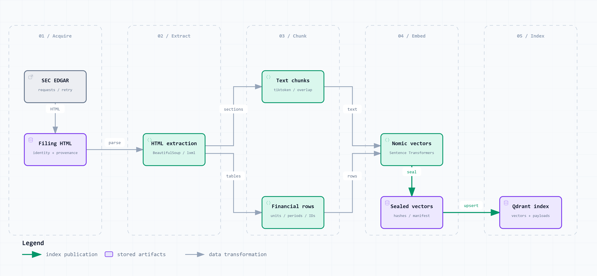
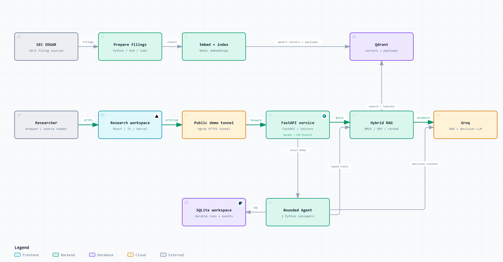
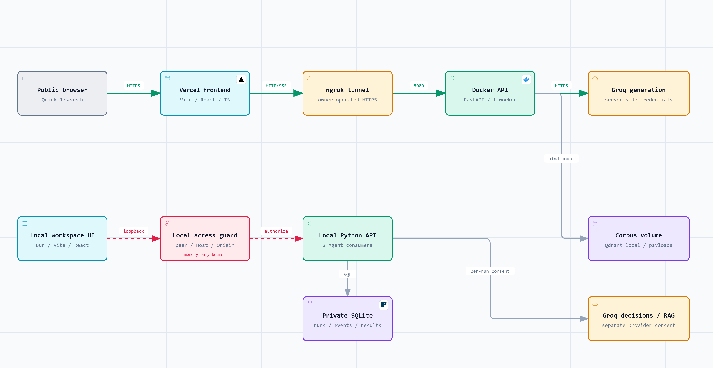

# FilingScope — Full Pipeline and Deployment

This guide maps each stage to its implementation and runtime technology. It
describes repository configuration, not a fresh audit of live service availability.

| View | Image | Interactive HTML | Editable specification |
|---|---|---|---|
| Detailed architecture poster | [PNG](system-map.png) | [Component overview](system-map.html) | [SVG](system-map.svg) / [JSON overview](system-map.architecture.json) |
| Full service pipeline | [PNG](full-pipeline.png) | [HTML](full-pipeline.html) | [JSON](full-pipeline.architecture.json) |
| SEC corpus preparation | [PNG](corpus-pipeline.png) | [HTML](corpus-pipeline.html) | [JSON](corpus-pipeline.dataflow.json) |
| Deployment and access | [PNG](deployment.png) | [HTML](deployment.html) | [JSON](deployment.architecture.json) |
| Hybrid Search internals | [PNG](hybrid-search.png) | [HTML](hybrid-search.html) | [Source note](HYBRID_SEARCH.md) |

Download the standalone HTML and open it locally. It supports node inspection,
source links where authored, relationship tracing, zoom, themes and clean exports.
GitHub displays the PNGs but does not execute HTML from its file viewer.

The [poster reading guide](SYSTEM_MAP.md) explains the detailed numbered bands,
cache bypass, private Agent boundary and diagram verification.

## 1. Offline corpus preparation



| Stage | Technology and behavior | Implementation |
|---|---|---|
| Acquire filings | Python `requests`; identified SEC User-Agent, rate control and retries; filing identity and acquisition provenance | [Downloader](../../scripts/download_filings.py), [SEC client](../../src/ingestion/sec_client.py) |
| Extract narrative | BeautifulSoup and lxml parse HTML and filing sections | [Section extractor](../../src/ingestion/section_extractor.py) |
| Extract financial tables | Table discovery and extraction retain row labels, reporting periods and units | [Discovery](../../src/ingestion/table_discovery.py), [Extractor](../../src/ingestion/table_extractor.py), [Table chunks](../../scripts/add_table_chunks.py) |
| Chunk text | Recursive splitting with `tiktoken` token budgets and overlap; canonical chunk identities | [Chunker](../../src/ingestion/chunker.py), [Chunk command](../../scripts/chunk_filings.py) |
| Embed text and rows | SentenceTransformers/Nomic; `search_document: ` for corpus text and `search_query: ` for queries | [Embedder](../../src/retrieval/embedder.py), [Embedding command](../../scripts/embed_chunks.py) |
| Seal a generation | Immutable completed vectors, metadata, hashes and generation manifest | [Generation contract](../../src/retrieval/embedding_generation.py) |
| Publish index | Verify corpus/vector/model fingerprints and point counts; upsert Qdrant vectors with identity-bearing payloads | [Index command](../../scripts/index_chunks.py) |
| Start retrieval | Load local artifacts or hydrate cloud payloads; rebuild BM25 and structured lookup | [Hybrid retriever](../../src/retrieval/hybrid_retriever.py) |

Preparation order, from the repository root in the activated backend environment:

```powershell
python -m scripts.download_filings
python -m scripts.chunk_filings
python -m scripts.add_table_chunks
python -m scripts.embed_chunks --generation-id <new-unused-generation-id>
# Set EMBEDDING_GENERATION_PATH to that completed generation before indexing.
python -m scripts.index_chunks
```

Rechunking can remove appended table chunks. Rebuild tables, embeddings and the
index in order; old embedded JSONL is not an indexing fallback. `data/` and model
caches remain local ignored artifacts. See [Setup](../SETUP.md#2-prepare-searchable-artifacts)
for credentials, SEC identity and exact environment settings.

### Model identity

| Role | Model | Pinned revision |
|---|---|---|
| Embeddings | `nomic-ai/nomic-embed-text-v1.5` | `e9b6763023c676ca8431644204f50c2b100d9aab` |
| Cross-encoder | `cross-encoder/ms-marco-MiniLM-L-6-v2` | `233902d25c440f23af6f7d6e94d2946bac0bee0a` |

The generator's code default is `openai/gpt-oss-120b` served through Groq;
runtime model selection can override it. The decision provider resolves the
configured generator model into a supported, frozen run binding. This is a
provider model identifier, not a local model-weight revision.

These pins come from [.env.example](../../.env.example) and
[Dockerfile](../../Dockerfile). Docker preloads the models and installs CPU-only
PyTorch. Local development can select CUDA when available. Model changes require
matching corpus/index provenance; this guide does not change the pins.

## 2. Quick Research request and evidence flow



1. **Submit:** React/TypeScript captures the question, conversation and visible
   scope. FastAPI validates the request and owns HTTP/SSE and cancellation.
2. **Shape the query:** the RAG pipeline handles conversational query shaping and
   computes the query embedding. An eligible semantic-cache hit can replay an
   answer; the search diagram shows the cache-miss path.
3. **Retrieve:** BM25 supplies lexical ranks; Qdrant supplies dense ranks. The
   optional lexical ladder adds phrase, term and fuzzy candidates. Scope filters
   constrain retrieval. These stages execute sequentially in the current code.
4. **Fuse and rerank:** RRF merges by chunk identity with constant 60. The pinned
   cross-encoder scores query/passage pairs. Relevance filtering, eligible
   structured-table promotion and top-k selection narrow the result.
5. **Build context:** render bounded evidence with stable citation identities.
   The generator treats retrieved text as untrusted source data.
6. **Generate and stream:** Groq produces the configured model response; FastAPI
   streams source metadata and answer tokens to the browser.
7. **Inspect:** citations resolve to indexed excerpts and source-reader views.
   Original acquisition/viewer admission is a separate path. Missing originals
   remain explicit; ingestion does not imply every HTML/PDF view is available.

Implementation: [RAG pipeline](../../src/generation/rag_pipeline.py),
[Retriever](../../src/retrieval/hybrid_retriever.py),
[Generator](../../src/generation/generator.py),
[Frontend contract](../frontend/FRONTEND_CONTRACT.md),
[Detailed Hybrid Search explanation](HYBRID_SEARCH.md).

## 3. Private Deep Research execution

The full service overview combines mode-dependent services. Its `local Deep`
branch is conditional on private local configuration; it is not an execution
permission granted by the public ngrok connection.

| Step | Mechanism | Implementation |
|---|---|---|
| Connect locally | Direct loopback peer, exact Host and Origin, execution capability and memory-only bearer | [Access policy](../../src/api/access.py), [Local setup](../SETUP.md#4-enable-local-deep-research-explicitly) |
| Submit a goal | Explicit goal submission with per-run decision-provider consent; strict Pydantic contracts | [Agent API](../../src/api/routers/agent_runs.py) |
| Persist and claim | SQLite owns run state and ordered events; atomic durable claims; wake hints only reduce polling delay | [Repository](../../src/workspace/repository.py), [Worker](../../src/workspace/worker.py) |
| Choose the next action | One bounded Agent uses structured provider decisions and configured limits | [Durable executor](../../src/agent/durable.py), [Provider](../../src/agent/provider.py) |
| Invoke a closed tool | Validated typed inputs, capability policy and separate decision/RAG permissions | [Tool registry](../../src/agent/tools.py) |
| Store and inspect | Persist evidence, results and terminal evaluation; frontend holds a durable run reference | [Database](../../src/workspace/database.py), [Contracts](../../ARCHITECTURE.md) |
| Cancel or restart | Cancellation acknowledged at safe boundaries; uncertain claimed work becomes interrupted after restart instead of replaying external effects | [Worker](../../src/workspace/worker.py), [Executor](../../src/agent/durable.py) |

The four tools are:

- `search_documents`: deterministic BM25 discovery.
- `inspect_retrieval`: inspect ranking behavior and candidates.
- `read_document`: read indexed excerpts/catalog records; it does not acquire
  an original filing over the network.
- `ask_rag`: reuse provider-backed grounded RAG when the run permits it.

Two fixed consumers run inside the Python process. SQLite WAL and short writes
own authority; model/tool work occurs outside transactions. This is process-local
execution. Browser storage and wake hints are not the durable job queue. Decision
permission does not automatically grant RAG-provider permission.

## 4. Deployment and ownership



### Public demo configuration

| Component | Runtime / host | Configuration |
|---|---|---|
| Frontend | Vercel; independent Vite static build | Root `frontend`; [vercel.json](../../frontend/vercel.json) rewrites SPA routes and caches assets |
| API | Owner's Docker host, Docker Compose | [Dockerfile](../../Dockerfile), [Compose](../../docker-compose.yml); Python 3.12, FastAPI/Uvicorn, port 8000, one worker |
| HTTPS ingress | Owner's ngrok process forwards to the API | [Start script](../../scripts/start_demo.ps1), [Setup](../SETUP.md#5-docker-cloud-and-public-frontend) |
| Corpus storage | Qdrant local plus prepared payloads | Compose bind-mounts `./data/processed` at `/app/data/processed` |
| Provider | Groq called from the backend | Backend credentials and provider policy; never put secrets in browser `VITE_*` settings |

Set `VITE_API_BASE_URL` to the reachable HTTPS backend and list the deployed
frontend domain in `ALLOWED_ORIGINS`. The frontend does not live inside the backend
image. Public questions depend on the owner's API and tunnel being online; static
frontend availability does not prove API readiness. `/health/ready` reports runtime
readiness. The diagrams do not assert an always-on cloud backend deployment.

### Private local execution configuration

Private Deep uses the explicitly configured local Python runtime, local UI/access
connection and ignored SQLite workspace storage. The public Compose file does
not forward the private execution settings or provision its SQLite persistence.
Follow [private setup](../SETUP.md#4-enable-local-deep-research-explicitly).

The upper public and lower private paths are configuration modes, not a prescription
for concurrent Python processes sharing one local Qdrant directory. Qdrant local
storage has a file lock. Use one owning API process or separate storage; adopt
server/cloud mode before multiple processes. The private path reuses the retrieval
services shown in the full pipeline; that storage wiring is omitted in the access
diagram to keep the two ingress paths readable.

### Supported storage alternative

Qdrant Cloud is supported. Startup hydrates its chunk payloads to rebuild BM25 and
structured lookup, so a stateless cloud image does not require the ignored local
corpus artifacts. Migration, manifest and verification requirements still apply.
The deployment image depicts the checked-in local Compose mode; it does not claim
that a Qdrant Cloud migration or a new hosting deployment occurred in this task.

### Build and automated checks

| Track | Tools | Checked-in workflow |
|---|---|---|
| Backend | GitHub Actions, Python 3.12, CPU PyTorch, hermetic pytest and compilation | [backend.yml](../../.github/workflows/backend.yml) |
| Frontend | Bun 1.3.14, TypeScript, Vitest, Vite build, Playwright Chromium/Firefox | [frontend.yml](../../.github/workflows/frontend.yml), [package.json](../../frontend/package.json) |

These workflows perform checks. Vercel frontend deployment and owner-operated
Compose/ngrok startup are separate operations; the repository does not establish
an automatic GitHub Actions backend deployment chain.

## 5. Diagram delivery and review

Authored on 2026-10-04 in English from repository evidence at product-source
revision `d8afc4b78bb2dd24c2c815067044a33b58c2dc14`. The HTML/specification pairs
below are the exact final delivered bytes. PNGs use native full-diagram light-theme
exports. Only public diagrams and documentation are committed; diagnostic captures
and local receipts remain ignored.

Deterministic delivery, bounded browser measurements and perceptual review are
separate claims. All three artifacts passed **9/9 showcase checks with 0 errors
and 0 warnings**. CUA inspected the actual HTML at 1440×900, 1600×1000,
1920×1080 and 2048×1320, with light/dark endpoint captures. The renderer's separate
`visual-check` command was not run; no automated-command pass is claimed.

| Artifact | Type | Spec bytes | HTML bytes | PNG dimensions | Visual corrections |
|---|---|---:|---:|---|---:|
| full-pipeline | `architecture` | 7,567 | 740,654 | 5520×2880 | 0 |
| corpus-pipeline | `dataflow` | 4,230 | 726,555 | 4320×2000 | 1 |
| deployment | `architecture` | 6,962 | 736,665 | 4800×2480 | 1 |

All checked desktop measurements had no horizontal or vertical overflow.
Perceptual review passed for the actual light/dark HTML and the native PNG
exports: readable nodes, clear routes/labels, balanced large-screen composition
and clean exports. The corpus labels were shortened to avoid icon collisions;
the deployment bind-mount label was moved onto its route.

### full-pipeline

Specification SHA-256:
`e63b89bb72fb506ddb4842e77403ad8c87a14bf7a4214103e807b922999ad955`

HTML SHA-256:
`7886bfc32d16443fa21d7383421abcab502370309cd902ceaef6eb78216d823e`

### corpus-pipeline

Specification SHA-256:
`e01cbe837c213c38761444ef380e429604739b70f70d121db388cf019a9194d4`

HTML SHA-256:
`3eeb973d8d9e00b1ba03da89e2fd3e3f73c036724e7db8dc898e0aafd9892dd7`

### deployment

Specification SHA-256:
`d887eec87c51f333ec3645d75673741d214656c0bfc4904efa11febb7af97890`

HTML SHA-256:
`cb861310903608db357e07e477448222b4cf428f26e58f87e0f298df63c7f137`
